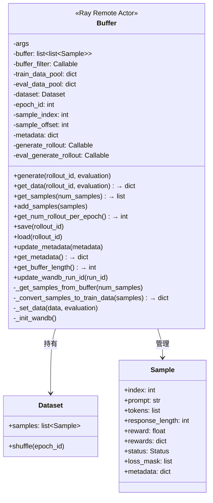
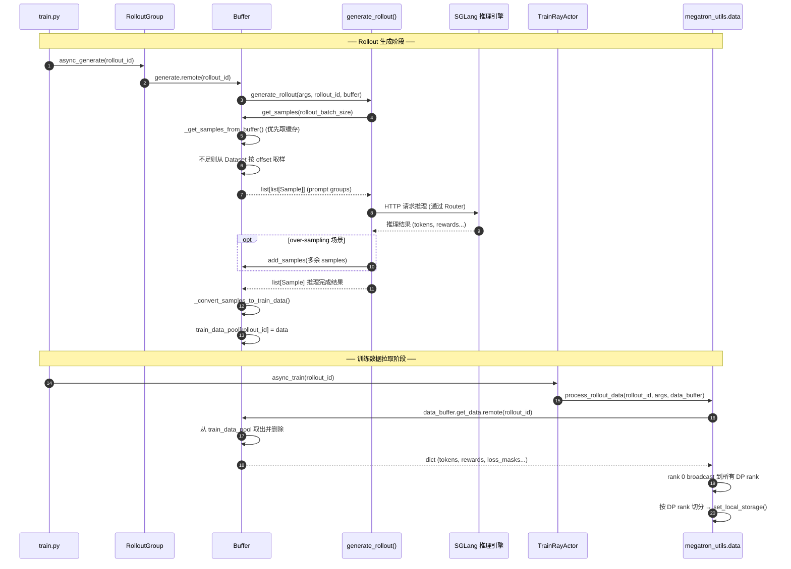

# Buffer 对象详解

## 概述

[Buffer](file:///home/robomaster/Research/TritonForge/SLIME/slime/ray/buffer.py#27-299) 是一个 **Ray Remote Actor**（仅占用 CPU，不占 GPU），是 SLIME 训练系统中 **Rollout 推理与 Actor 训练之间的数据中枢**。它负责：

1. **管理 Prompt 数据源** → 从 Dataset 中按需取样
2. **调用 Rollout 函数生成推理数据** → 调用用户自定义的 [generate_rollout](file:///home/robomaster/Research/TritonForge/SLIME/slime/rollout/agent_rollout.py#317-320) 函数
3. **缓存和过滤样本** → 支持 over-sampling / dynamic-sampling 等策略
4. **存储训练数据** → 将推理结果转换为训练格式，供 TrainRayActor 拉取
5. **持久化状态** → save/load Dataset 偏移量，支持断点续训

## 类结构图



## 数据流向全景图

```mermaid
flowchart TB
    subgraph 初始化阶段
        RG["RolloutGroup.__init__()"] -->|"Buffer.remote(args)"| BUF["Buffer (Ray Remote)"]
        BUF -->|"load_function()"| GR["generate_rollout 函数<br/>(sglang_example / agent_rollout / sft_example)"]
        BUF -->|"load_function()"| EGR["eval_generate_rollout 函数"]
        BUF -->|"可选: Dataset(prompt_data)"| DS["Dataset"]
    end

    subgraph Rollout生成阶段["每个 rollout_id 的 Rollout 生成"]
        TRAIN_PY["train.py"] -->|"async_generate(rollout_id)"| RG2["RolloutGroup"]
        RG2 -->|"data_buffer.generate.remote()"| GEN["Buffer.generate()"]
        GEN -->|"调用"| GR2["generate_rollout(args, rollout_id, buffer)"]
        GR2 -->|"buffer.get_samples()"| GS["Buffer.get_samples()"]
        GS -->|"优先从 buffer 取"| BF["buffer (缓存池)"]
        GS -->|"不足则从 Dataset 取"| DS2["Dataset.samples"]
        GR2 -->|"推理后返回 list~Sample~"| GEN
        GR2 -.->|"可选: buffer.add_samples()"| AS["Buffer.add_samples()"]
        GEN -->|"_set_data()"| SD["_convert_samples_to_train_data()"]
        SD -->|"存入"| TDP["train_data_pool[rollout_id]"]
    end

    subgraph 训练数据拉取阶段["每个 rollout_id 的训练数据拉取"]
        TRA["TrainRayActor.train()"] -->|"get_rollout_data()"| PRD["megatron_utils.<br/>process_rollout_data()"]
        PRD -->|"data_buffer.get_data.remote(rollout_id)"| GD["Buffer.get_data()"]
        GD -->|"取出并删除"| TDP2["train_data_pool[rollout_id]"]
        GD -->|"返回 dict"| PRD
        PRD -->|"broadcast 到所有 DP rank"| LS["LOCAL_STORAGE<br/>(每个 TrainRayActor 本地)"]
    end

    subgraph 持久化
        TRAIN_PY2["train.py"] -->|"data_buffer.save.remote()"| SAVE["Buffer.save()"]
        TRAIN_PY2 -->|"data_buffer.load.remote()"| LOAD["Buffer.load()"]
        SAVE -->|"torch.save()"| CKPT["rollout/global_dataset_state_dict_{id}.pt"]
        LOAD -->|"torch.load()"| CKPT
    end

    style BUF fill:#2d5a27,stroke:#4a8,color:#fff
    style TDP fill:#5a2d27,stroke:#a84,color:#fff
    style TDP2 fill:#5a2d27,stroke:#a84,color:#fff
    style DS fill:#27355a,stroke:#48a,color:#fff
    style DS2 fill:#27355a,stroke:#48a,color:#fff
```



## Buffer 内部的两个数据池

Buffer 内部有两个关键的数据结构：

| 数据结构 | 类型 | 写入者 | 读取者 | 生命周期 |
|---------|------|--------|--------|---------|
| **[buffer](file:///home/robomaster/Research/TritonForge/SLIME/slime/ray/ppo_actor.py#245-250)** | `list[list[Sample]]` | [add_samples()](file:///home/robomaster/Research/TritonForge/SLIME/slime/ray/buffer.py#166-177) / [get_samples()](file:///home/robomaster/Research/TritonForge/SLIME/slime/ray/buffer.py#116-158) 未用完时残留 | [get_samples()](file:///home/robomaster/Research/TritonForge/SLIME/slime/ray/buffer.py#116-158) → rollout 函数 | 跨 rollout_id 持续存在，over-sampling 剩余样本缓存 |
| **`train_data_pool`** | `dict[rollout_id → dict]` | [generate()](file:///home/robomaster/Research/TritonForge/SLIME/slime/ray/buffer.py#178-197) → [_set_data()](file:///home/robomaster/Research/TritonForge/SLIME/slime/ray/buffer.py#243-253) | [get_data()](file:///home/robomaster/Research/TritonForge/SLIME/slime/ray/buffer.py#198-204) → TrainRayActor | 每个 rollout_id 写一次读一次后删除 |
| **`eval_data_pool`** | `dict[rollout_id → Any]` | [generate(evaluation=True)](file:///home/robomaster/Research/TritonForge/SLIME/slime/ray/buffer.py#178-197) | [get_data(evaluation=True)](file:///home/robomaster/Research/TritonForge/SLIME/slime/ray/buffer.py#198-204) | 每个 rollout_id 写一次读一次后删除 |

### 数据转换流程

```
Prompt (Dataset)
  ↓ get_samples()
list[list[Sample]]          ← 每组 n_samples_per_prompt 个 Sample，共享同一 prompt
  ↓ generate_rollout()      ← 调用 SGLang 推理，填充 tokens/reward/response_length
list[Sample]                ← 扁平化后的推理结果
  ↓ _convert_samples_to_train_data()
dict{                       ← 训练数据格式
  "tokens": list[list[int]],
  "response_lengths": list[int],
  "rewards": list[float],
  "truncated": list[int],
  "loss_masks": list[list[int]],
}
  ↓ train_data_pool[rollout_id] = dict
  ↓ get_data(rollout_id)    ← TrainRayActor 通过 ray.get 拉取
dict → broadcast 到各 DP rank → LOCAL_STORAGE
```

## 时序图：一次完整的 Rollout-Train 数据流



## 三种 Rollout 函数的 Buffer 使用模式

| Rollout 函数 | 文件 | Buffer 使用方式 |
|-------------|------|----------------|
| **sglang_example** | [sglang_example.py](file:///home/robomaster/Research/TritonForge/SLIME/slime/rollout/sglang_example.py) | [get_samples()](file:///home/robomaster/Research/TritonForge/SLIME/slime/ray/buffer.py#116-158) 取样 → SGLang 批量推理 → 支持 [add_samples()](file:///home/robomaster/Research/TritonForge/SLIME/slime/ray/buffer.py#166-177) over-sampling |
| **agent_rollout** | [agent_rollout.py](file:///home/robomaster/Research/TritonForge/SLIME/slime/rollout/agent_rollout.py) | [get_metadata()](file:///home/robomaster/Research/TritonForge/SLIME/slime/backends/megatron_utils/data.py#42-44) 获取历史 → 从外部 API 拉取 → [add_samples()](file:///home/robomaster/Research/TritonForge/SLIME/slime/ray/buffer.py#166-177) + [get_samples()](file:///home/robomaster/Research/TritonForge/SLIME/slime/ray/buffer.py#116-158) 组合使用 → [update_metadata()](file:///home/robomaster/Research/TritonForge/SLIME/slime/ray/buffer.py#254-256) 记录完成的 group |
| **sft_example** | [sft_example.py](file:///home/robomaster/Research/TritonForge/SLIME/slime/rollout/sft_example.py) | 仅 [get_samples()](file:///home/robomaster/Research/TritonForge/SLIME/slime/ray/buffer.py#116-158) 取样 → 直接作为 SFT 数据返回（无推理） |

## 关键设计要点

> [!IMPORTANT]
> Buffer 运行在**独立的 Ray Actor 进程**中（仅 CPU），与 TrainRayActor 和 RolloutRayActor 不在同一进程。所有方法调用通过 `ray.remote()` 进行，天然线程安全。

> [!TIP]
> [buffer](file:///home/robomaster/Research/TritonForge/SLIME/slime/ray/ppo_actor.py#245-250)（缓存池）支持跨 rollout_id 的数据复用，这是 over-sampling 和 dynamic-sampling 策略的基础：多余样本不丢弃，缓存到下次 rollout 使用。

> [!NOTE]
> [generate_rollout](file:///home/robomaster/Research/TritonForge/SLIME/slime/rollout/agent_rollout.py#317-320) 函数是通过 `load_function(args.rollout_function_path)` 动态加载的，Buffer 不关心具体推理逻辑，只要求返回 `list[Sample]`。这使得用户可以自定义任意 rollout 策略。
