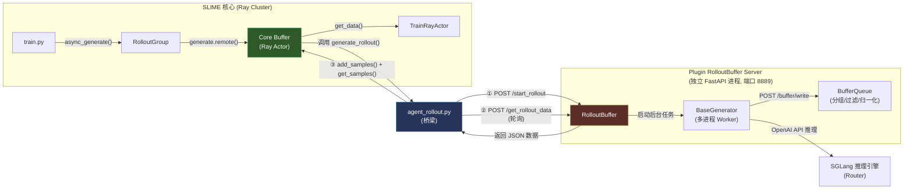
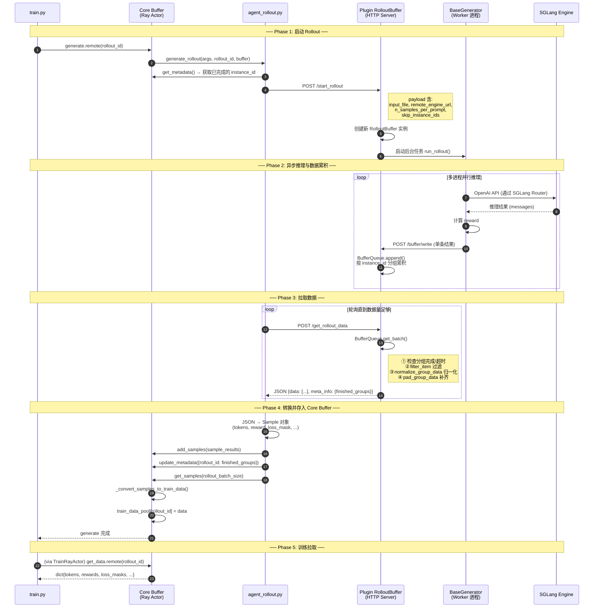

# Core Buffer 与 Plugin RolloutBuffer 的交互关系

## 一句话总结

**它们不直接交互。** [agent_rollout.py](file:///home/robomaster/Research/TritonForge/SLIME/slime/rollout/agent_rollout.py) 是桥梁，从 Plugin RolloutBuffer（HTTP 服务器）拉取数据，转换后写入 Core Buffer（Ray Actor）。

## 架构对比

| 维度 | Core Buffer | Plugin RolloutBuffer |
|------|-------------|---------------------|
| **文件** | [buffer.py](file:///home/robomaster/Research/TritonForge/SLIME/slime/ray/buffer.py) | [buffer.py](file:///home/robomaster/Research/TritonForge/SLIME/slime_plugins/rollout_buffer/buffer.py) |
| **运行方式** | Ray Remote Actor（进程内调用） | FastAPI HTTP Server（独立进程，端口 8889） |
| **职责** | 管理 prompt 取样 + 存储训练数据 | 接收推理结果 + 分组/过滤/归一化/补齐 |
| **数据格式** | `Sample` 对象 → `dict{tokens, rewards, ...}` | 原始推理 JSON（含 messages, reward, instance_id） |
| **使用场景** | 所有训练模式 | 仅 [agent_rollout](file:///home/robomaster/Research/TritonForge/SLIME/slime/rollout/agent_rollout.py#225-315) 模式（异步外部推理） |

## 交互拓扑图



## 为什么需要两个 Buffer？

> [!IMPORTANT]
> Plugin RolloutBuffer 解决的是 **异步、多进程、长时间运行的外部推理任务**（如 Agent 多轮对话、代码执行验证）。这类任务耗时不一，结果需要按 `instance_id` 分组、等待超时、过滤无效结果、归一化奖励后才能用于训练。Core Buffer 不具备这些能力。

| 问题 | Core Buffer 方案 | Plugin RolloutBuffer 方案 |
|------|-----------------|-------------------------|
| 推理耗时不一 | 同步等待所有结果 | 异步累积，按组超时判定 |
| 结果需分组 | 简单 `n_samples_per_prompt` 分组 | 按 `instance_id` 自动分组 + 超时 |
| 无效结果过滤 | 无 | `filter_item()` + [is_valid_group()](file:///home/robomaster/Research/TritonForge/SLIME/slime_plugins/rollout_buffer/generator/base_generator.py#322-344) |
| 奖励归一化 | GRPO 级别的简单 group norm | 任务定制化 [normalize_group_data()](file:///home/robomaster/Research/TritonForge/SLIME/slime_plugins/rollout_buffer/generator/base_generator.py#292-320) |
| 结果不足时补齐 | 无 | `pad_group_data()` 补到 `group_size` |

## 详细时序图



## 数据转换链路

```
Plugin 侧 (JSON):
{
  "uid": "xxx",
  "instance_id": "problem_001",
  "messages": [{role, content}, ...],     ← 对话历史
  "reward": 0.85,                         ← 已归一化的奖励
  "raw_reward": 1.0,                      ← 原始奖励
  "extra_info": {timestamp, round_number, ...}
}
        │
        │ agent_rollout.py 转换
        ▼
Core Buffer 侧 (Sample):
Sample(
  index = instance_id,
  prompt = uid,
  tokens = tokenizer.encode(messages),    ← tokenize 完整对话
  response_length = ...,                  ← 从 loss_mask 计算
  reward = 0.85,
  loss_mask = [...],                      ← MultiTurnLossMaskGenerator 生成
  metadata = {raw_reward: 1.0, ...}
)
        │
        │ _convert_samples_to_train_data()
        ▼
训练数据 (dict):
{
  "tokens": [[token_ids], ...],
  "response_lengths": [int, ...],
  "rewards": [float, ...],
  "loss_masks": [[0,0,1,1,...], ...],
  "truncated": [0, ...],
}
```

## 关键代码位置

| 步骤 | 代码位置 |
|------|---------|
| agent_rollout 调用 [start_rollout](file:///home/robomaster/Research/TritonForge/SLIME/slime/rollout/agent_rollout.py#186-223) | [agent_rollout.py:186-222](file:///home/robomaster/Research/TritonForge/SLIME/slime/rollout/agent_rollout.py#L186-L222) |
| agent_rollout 轮询 [get_rollout_data](file:///home/robomaster/Research/TritonForge/SLIME/slime/ray/ppo_actor.py#251-255) | [agent_rollout.py:133-183](file:///home/robomaster/Research/TritonForge/SLIME/slime/rollout/agent_rollout.py#L133-L183) |
| agent_rollout 转换 JSON → Sample | [agent_rollout.py:287-308](file:///home/robomaster/Research/TritonForge/SLIME/slime/rollout/agent_rollout.py#L287-L308) |
| Plugin 接收 `/start_rollout` | [plugin buffer.py:640-644](file:///home/robomaster/Research/TritonForge/SLIME/slime_plugins/rollout_buffer/buffer.py#L640-L644) |
| Plugin 返回 `/get_rollout_data` | [plugin buffer.py:450-487](file:///home/robomaster/Research/TritonForge/SLIME/slime_plugins/rollout_buffer/buffer.py#L450-L487) |
| BaseGenerator 写入 plugin buffer | [base_generator.py:161-177](file:///home/robomaster/Research/TritonForge/SLIME/slime_plugins/rollout_buffer/generator/base_generator.py#L161-L177) |
