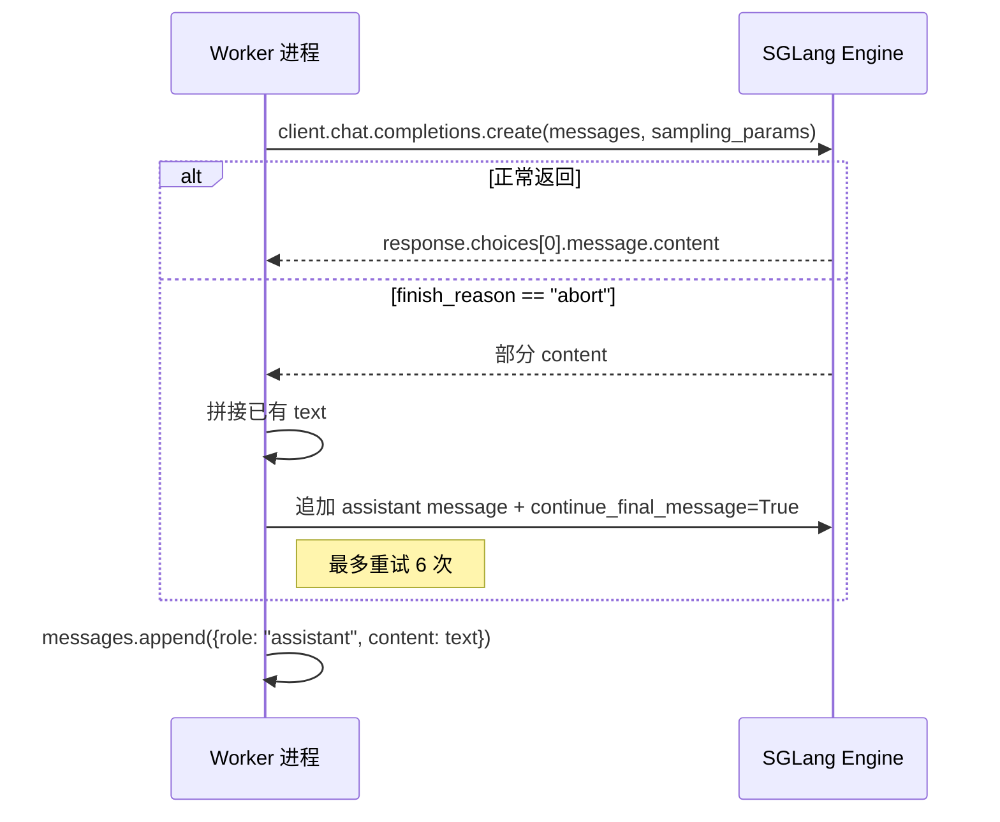
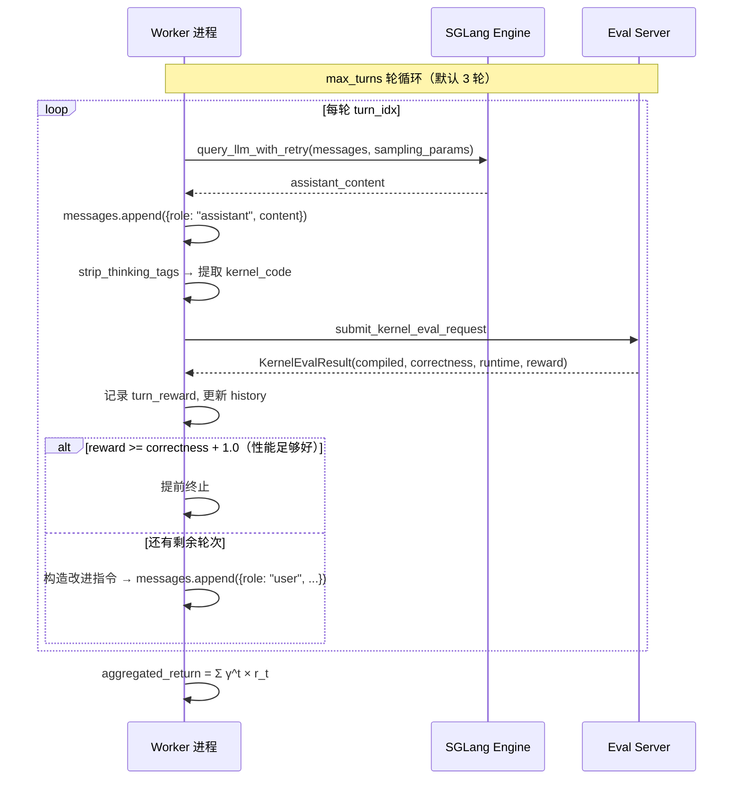
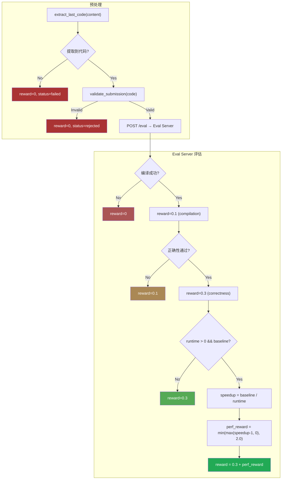
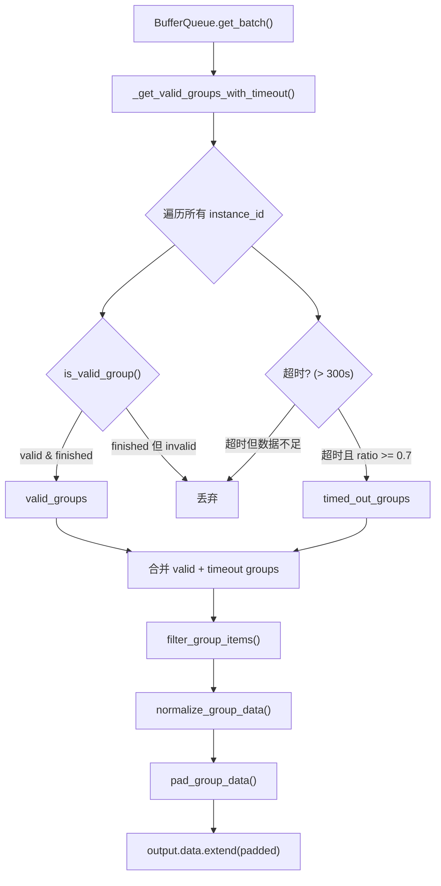
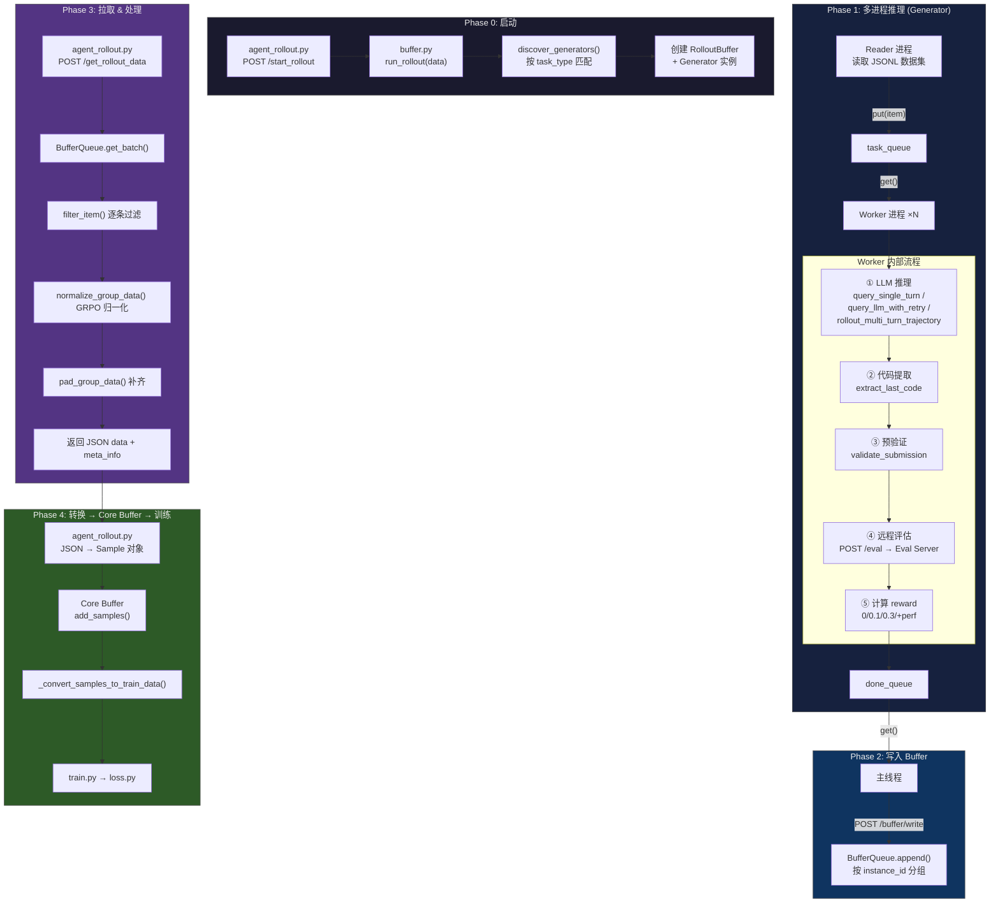

# Plugin 具体实现逻辑与数据链路

> [!NOTE]
> 本文档是对 [buffer_plugin_interaction.md](file:///home/robomaster/.gemini/antigravity/brain/b3ae46d6-c524-41a3-aa67-84236bf4b0be/buffer_plugin_interaction.md) 的补充，聚焦 Plugin 侧（`slime_plugins/rollout_buffer/`）的**内部实现细节**：LLM 交互、代码评估、奖励计算、数据处理。

---

## 一、Generator 插件体系

Plugin 通过 [discover_generators()](file:///home/robomaster/Research/TritonForge/SLIME/slime_plugins/rollout_buffer/buffer.py#34-102) 自动发现 [generator/](file:///home/robomaster/Research/TritonForge/SLIME/slime_plugins/rollout_buffer/buffer.py#34-102) 下所有 `*_generator.py` 文件，按 `TASK_TYPE` 常量注册。

| Generator 类 | TASK_TYPE | 场景 | 文件 |
|---|---|---|---|
| [BaseGenerator](file:///home/robomaster/Research/TritonForge/SLIME/slime_plugins/rollout_buffer/generator/base_generator.py#127-262) | `math` | 数学推理（单轮） | [base_generator.py](file:///home/robomaster/Research/TritonForge/SLIME/slime_plugins/rollout_buffer/generator/base_generator.py) |
| [KernelGenerator](file:///home/robomaster/Research/TritonForge/SLIME/slime_plugins/rollout_buffer/generator/kernel_generator.py#478-588) | `kernelbench` | Triton Kernel 生成（单轮） | [kernel_generator.py](file:///home/robomaster/Research/TritonForge/SLIME/slime_plugins/rollout_buffer/generator/kernel_generator.py) |
| [MultiTurnKernelGenerator](file:///home/robomaster/Research/TritonForge/SLIME/slime_plugins/rollout_buffer/generator/multi_turn_kernel_generator.py#583-715) | `kernelbench_multiturn` | Triton Kernel 生成（多轮迭代） | [multi_turn_kernel_generator.py](file:///home/robomaster/Research/TritonForge/SLIME/slime_plugins/rollout_buffer/generator/multi_turn_kernel_generator.py) |

每个 Generator 模块须导出：
- **`TASK_TYPE`**：字符串常量，用于路由
- **[run_rollout(data: dict)](file:///home/robomaster/Research/TritonForge/SLIME/slime_plugins/rollout_buffer/buffer.py#581-638)**：入口函数，由 [buffer.py](file:///home/robomaster/Research/TritonForge/SLIME/slime/ray/buffer.py) 的 `/start_rollout` 路由调用
- 可选覆盖：[normalize_group_data](file:///home/robomaster/Research/TritonForge/SLIME/slime_plugins/rollout_buffer/generator/base_generator.py#292-320)、[pad_group_data](file:///home/robomaster/Research/TritonForge/SLIME/slime_plugins/rollout_buffer/generator/utils/default_func.py#68-100)、[is_valid_group](file:///home/robomaster/Research/TritonForge/SLIME/slime_plugins/rollout_buffer/generator/base_generator.py#322-344)、[filter_item](file:///home/robomaster/Research/TritonForge/SLIME/slime_plugins/rollout_buffer/generator/utils/default_func.py#180-209)、[get_group_data_meta_info](file:///home/robomaster/Research/TritonForge/SLIME/slime_plugins/rollout_buffer/generator/utils/default_func.py#134-178)

---

## 二、LLM 交互机制

### 2.1 单轮交互：[query_single_turn](file:///home/robomaster/Research/TritonForge/SLIME/slime_plugins/rollout_buffer/generator/base_generator.py#24-91)

```
用途: math 任务 (BaseGenerator)
位置: base_generator.py L24-90
```



**关键细节**：
- 使用 `continue_final_message=True` 实现**续写**（当推理被 abort 时拼接已生成内容继续）
- 每次调用生成随机 `seed`，确保多次采样结果不同
- 返回的是完整 messages 列表（包含 assistant 回复）

### 2.2 单轮交互：[query_llm_with_retry](file:///home/robomaster/Research/TritonForge/SLIME/slime_plugins/rollout_buffer/generator/kernel_generator.py#297-314)（KernelBench 专用）

```
用途: kernelbench / kernelbench_multiturn 任务
位置: kernel_generator.py L297-313
```

- 使用 `tenacity` 库实现指数退避重试（最多 5 次，等待 4~15 秒）
- 只返回 content 字符串（不返回整个 messages 列表）
- 调用方 [rollout_one_trajectory](file:///home/robomaster/Research/TritonForge/SLIME/slime_plugins/rollout_buffer/generator/kernel_generator.py#316-349) 负责组装 messages

### 2.3 多轮交互：[rollout_multi_turn_trajectory](file:///home/robomaster/Research/TritonForge/SLIME/slime_plugins/rollout_buffer/generator/multi_turn_kernel_generator.py#232-481)

```
位置: multi_turn_kernel_generator.py L232-480
```



**两种 prompt 模式**：

| 模式 | `use_native_template` | 消息累积方式 |
|---|---|---|
| **原生模板** | `True`（默认） | 所有轮次在同一个 messages 列表中累积，自然多轮对话 |
| **历史拼接** | `False` | 每轮重新从 `original_prompt` 构造，将历史以文本形式拼入 user 消息 |

**多轮改进指令生成**（native 模式下）：
- 编译失败 → "Fixes the compilation errors"
- 正确性失败 → "Fixes the correctness issues"
- 已通过 → "Maintains correctness"
- 附带上一轮的 error message（截断 200 字符）

---

## 三、代码评估流程

### 3.1 评估入口：[submit_kernel_eval_request](file:///home/robomaster/Research/TritonForge/SLIME/slime_plugins/rollout_buffer/generator/kernel_generator.py#177-295)

```
位置: kernel_generator.py L177-294
```



### 3.2 代码提取与预验证

| 步骤 | 函数 | 文件 | 说明 |
|---|---|---|---|
| 剥离 `<think>` 标签 | [strip_thinking_tags](file:///home/robomaster/Research/TritonForge/SLIME/slime_plugins/rollout_buffer/generator/reward_utils/kernel_utils.py#L45-L89) | kernel_utils.py | 分离 CoT 推理内容与实际代码 |
| 提取代码块 | [extract_last_code](file:///home/robomaster/Research/TritonForge/SLIME/slime_plugins/rollout_buffer/generator/reward_utils/kernel_utils.py#L92-L161) | kernel_utils.py | 取最后一个 \`\`\`python/cpp\`\`\` 代码块 |
| 验证提交 | [validate_submission](file:///home/robomaster/Research/TritonForge/SLIME/slime_plugins/rollout_buffer/generator/kernel_generator.py#L92-L174) | kernel_generator.py | 检查 `@triton.jit`、Triton ops、`def forward` |

### 3.3 评估服务 Payload

```json
{
  "original_model_src": "原始 PyTorch 参考实现（来自 item['label']）",
  "custom_model_src": "LLM 生成的 Triton Kernel 代码",
  "num_correct_trials": 5,
  "num_perf_trials": 100,
  "measure_performance": true,
  "backend": "triton",
  "seed": 42
}
```

---

## 四、奖励计算体系

### 4.1 奖励等级（KernelBench）

配置来自 [kernelbench_config.py](file:///home/robomaster/Research/TritonForge/SLIME/slime_plugins/rollout_buffer/generator/kernelbench_config.py)：

| 等级 | reward | 条件 |
|---|---|---|
| 失败 | `0.0` | 代码提取失败 / 预验证失败 |
| 编译通过 | `0.1` | compiled = True |
| 正确性通过 | `0.3` | correctness = True |
| 性能加速 | `0.3 + min(max(speedup-1, 0), 2.0)` | 有效 runtime 且有 baseline |
| **最大 reward** | **2.3** | 3x+ 加速 |

### 4.2 多轮折扣回报

```python
# multi_turn_kernel_generator.py L209-229
aggregated_return = Σ (gamma^t × reward_t)  # t = 0, 1, ..., T-1
# 默认 gamma = 0.4, max_turns = 3
```

示例：3 轮 rewards = [0.0, 0.3, 1.3]
```
return = 0.4^0 × 0.0 + 0.4^1 × 0.3 + 0.4^2 × 1.3
       = 0 + 0.12 + 0.208
       = 0.328
```

### 4.3 数学任务奖励

使用 [get_rule_based_math_reward](file:///home/robomaster/Research/TritonForge/SLIME/slime_plugins/rollout_buffer/generator/reward_utils/math_utils.py)，基于规则匹配最终答案。

---

## 五、BufferQueue 数据处理流水线

Worker 完成推理后 → `POST /buffer/write` → `BufferQueue.append()` → 按 `instance_id` 分组累积。

当 [agent_rollout.py](file:///home/robomaster/Research/TritonForge/SLIME/slime/rollout/agent_rollout.py) 调用 `POST /get_rollout_data` 时触发 [get_batch()](file:///home/robomaster/Research/TritonForge/SLIME/slime_plugins/rollout_buffer/buffer.py#243-283)：



### 5.1 各处理函数详解

#### [filter_item](file:///home/robomaster/Research/TritonForge/SLIME/slime_plugins/rollout_buffer/generator/utils/default_func.py#180-209)（逐条过滤）
```
位置: default_func.py L180-208
```
- 检查必要字段：`instance_id`、[reward](file:///home/robomaster/Research/TritonForge/SLIME/slime_plugins/rollout_buffer/generator/kernel_generator.py#80-90)、`messages`
- 验证 reward ∈ [0, 1]
- 验证 messages 是 list

#### [is_valid_group](file:///home/robomaster/Research/TritonForge/SLIME/slime_plugins/rollout_buffer/generator/base_generator.py#322-344)（组级有效性）
```
位置: default_func.py L102-131
```
- `is_finished`：组大小 ≥ `min_valid_group_size`
- [is_valid](file:///home/robomaster/Research/TritonForge/SLIME/slime_plugins/rollout_buffer/generator/base_generator.py#322-344)：finished **且** reward 有多样性（[len(set(rewards)) > 1](file:///home/robomaster/Research/TritonForge/SLIME/slime_plugins/rollout_buffer/buffer.py#284-290)）
- 全组 reward 相同 → finished 但 invalid → 被丢弃

> [!IMPORTANT]
> 设计约束：**valid groups ⊆ finished groups**。所有 valid 的组必然是 finished 的，但 finished 的组可能因 reward 无多样性被丢弃。

#### [normalize_group_data](file:///home/robomaster/Research/TritonForge/SLIME/slime_plugins/rollout_buffer/generator/base_generator.py#292-320)（GRPO 归一化）
```
位置: default_func.py L25-65
```
```python
# 仅对 valid reward (0 ≤ r ≤ 1) 进行归一化
valid_rewards = [r for r in rewards if 0 <= r <= 1]
mean = avg(valid_rewards)
std = std(valid_rewards)
normalized_r = (r - mean) / (std + ε)

# 特殊情况:
# 全部为 0 → 跳过归一化
# std < ε → 全部设为 0（避免常数 reward 爆炸）
```

归一化后同时保存 `raw_reward`。

#### [pad_group_data](file:///home/robomaster/Research/TritonForge/SLIME/slime_plugins/rollout_buffer/generator/utils/default_func.py#68-100)（补齐到 group_size）
```
位置: default_func.py L68-99
```
```python
# 1. 先缩放: reward *= group_size / valid_size
# 2. 不足部分从头部复制并平分 reward（原样本和复制样本各得一半）
```

> [!TIP]
> 缩放公式 `reward * group_size / valid_size` 保证补齐后的 reward 总和与理想情况（所有样本都有效）的 GRPO 训练信号等价。

---

## 六、完整端到端数据链路



---

## 七、关键代码索引

| 组件 | 函数/类 | 位置 |
|---|---|---|
| **Generator 自动发现** | [discover_generators](file:///home/robomaster/Research/TritonForge/SLIME/slime_plugins/rollout_buffer/buffer.py#34-102) | [buffer.py:34-101](file:///home/robomaster/Research/TritonForge/SLIME/slime_plugins/rollout_buffer/buffer.py#L34-L101) |
| **Rollout 启动入口** | [run_rollout](file:///home/robomaster/Research/TritonForge/SLIME/slime_plugins/rollout_buffer/buffer.py#581-638) → [BufferQueue](file:///home/robomaster/Research/TritonForge/SLIME/slime_plugins/rollout_buffer/buffer.py#117-290) 初始化 | [buffer.py:581-637](file:///home/robomaster/Research/TritonForge/SLIME/slime_plugins/rollout_buffer/buffer.py#L581-L637) |
| **单轮 LLM 交互** | [query_single_turn](file:///home/robomaster/Research/TritonForge/SLIME/slime_plugins/rollout_buffer/generator/base_generator.py#24-91) | [base_generator.py:24-90](file:///home/robomaster/Research/TritonForge/SLIME/slime_plugins/rollout_buffer/generator/base_generator.py#L24-L90) |
| **带重试 LLM 交互** | [query_llm_with_retry](file:///home/robomaster/Research/TritonForge/SLIME/slime_plugins/rollout_buffer/generator/kernel_generator.py#297-314) | [kernel_generator.py:297-313](file:///home/robomaster/Research/TritonForge/SLIME/slime_plugins/rollout_buffer/generator/kernel_generator.py#L297-L313) |
| **多轮 Rollout** | [rollout_multi_turn_trajectory](file:///home/robomaster/Research/TritonForge/SLIME/slime_plugins/rollout_buffer/generator/multi_turn_kernel_generator.py#232-481) | [multi_turn_kernel_generator.py:232-480](file:///home/robomaster/Research/TritonForge/SLIME/slime_plugins/rollout_buffer/generator/multi_turn_kernel_generator.py#L232-L480) |
| **代码提取** | [extract_last_code](file:///home/robomaster/Research/TritonForge/SLIME/slime_plugins/rollout_buffer/generator/reward_utils/kernel_utils.py#92-162) | [kernel_utils.py:92-161](file:///home/robomaster/Research/TritonForge/SLIME/slime_plugins/rollout_buffer/generator/reward_utils/kernel_utils.py#L92-L161) |
| **CoT 标签处理** | [strip_thinking_tags](file:///home/robomaster/Research/TritonForge/SLIME/slime_plugins/rollout_buffer/generator/reward_utils/kernel_utils.py#45-90) | [kernel_utils.py:45-89](file:///home/robomaster/Research/TritonForge/SLIME/slime_plugins/rollout_buffer/generator/reward_utils/kernel_utils.py#L45-L89) |
| **Kernel 预验证** | [validate_submission](file:///home/robomaster/Research/TritonForge/SLIME/slime_plugins/rollout_buffer/generator/kernel_generator.py#92-175) | [kernel_generator.py:92-174](file:///home/robomaster/Research/TritonForge/SLIME/slime_plugins/rollout_buffer/generator/kernel_generator.py#L92-L174) |
| **Kernel 评估提交** | [submit_kernel_eval_request](file:///home/robomaster/Research/TritonForge/SLIME/slime_plugins/rollout_buffer/generator/kernel_generator.py#177-295) | [kernel_generator.py:177-294](file:///home/robomaster/Research/TritonForge/SLIME/slime_plugins/rollout_buffer/generator/kernel_generator.py#L177-L294) |
| **奖励配置** | `KERNELBENCH_REWARDS` | [kernelbench_config.py:4-8](file:///home/robomaster/Research/TritonForge/SLIME/slime_plugins/rollout_buffer/generator/kernelbench_config.py#L4-L8) |
| **多轮折扣回报** | [calculate_aggregated_return](file:///home/robomaster/Research/TritonForge/SLIME/slime_plugins/rollout_buffer/generator/multi_turn_kernel_generator.py#209-230) | [multi_turn_kernel_generator.py:209-229](file:///home/robomaster/Research/TritonForge/SLIME/slime_plugins/rollout_buffer/generator/multi_turn_kernel_generator.py#L209-L229) |
| **GRPO 归一化** | [default_normalize_group_data](file:///home/robomaster/Research/TritonForge/SLIME/slime_plugins/rollout_buffer/generator/utils/default_func.py#25-66) | [default_func.py:25-65](file:///home/robomaster/Research/TritonForge/SLIME/slime_plugins/rollout_buffer/generator/utils/default_func.py#L25-L65) |
| **组补齐** | [default_pad_group_data](file:///home/robomaster/Research/TritonForge/SLIME/slime_plugins/rollout_buffer/generator/utils/default_func.py#68-100) | [default_func.py:68-99](file:///home/robomaster/Research/TritonForge/SLIME/slime_plugins/rollout_buffer/generator/utils/default_func.py#L68-L99) |
| **组有效性判定** | [default_is_valid_group](file:///home/robomaster/Research/TritonForge/SLIME/slime_plugins/rollout_buffer/generator/utils/default_func.py#102-132) | [default_func.py:102-131](file:///home/robomaster/Research/TritonForge/SLIME/slime_plugins/rollout_buffer/generator/utils/default_func.py#L102-L131) |
| **多轮 Prompt 构造** | [construct_multi_turn_prompt](file:///home/robomaster/Research/TritonForge/SLIME/slime_plugins/rollout_buffer/generator/multi_turn_kernel_generator.py#133-207) | [multi_turn_kernel_generator.py:133-206](file:///home/robomaster/Research/TritonForge/SLIME/slime_plugins/rollout_buffer/generator/multi_turn_kernel_generator.py#L133-L206) |
| **多轮 Worker** | [worker_process_multi_turn](file:///home/robomaster/Research/TritonForge/SLIME/slime_plugins/rollout_buffer/generator/multi_turn_kernel_generator.py#483-581) | [multi_turn_kernel_generator.py:483-580](file:///home/robomaster/Research/TritonForge/SLIME/slime_plugins/rollout_buffer/generator/multi_turn_kernel_generator.py#L483-L580) |
