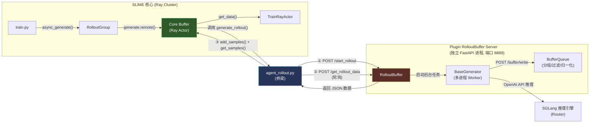
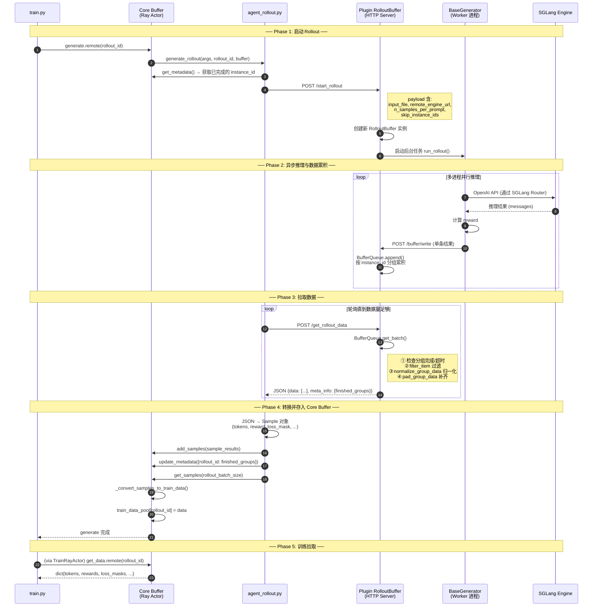
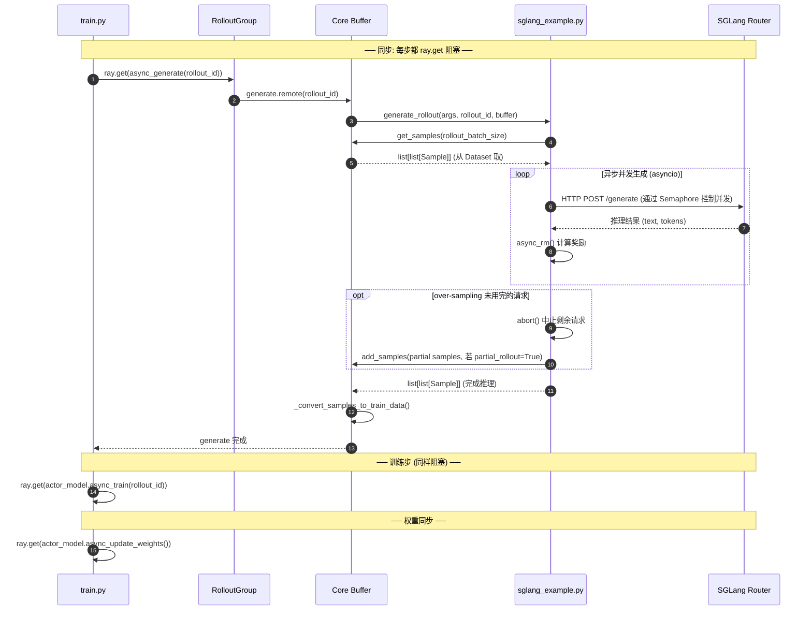
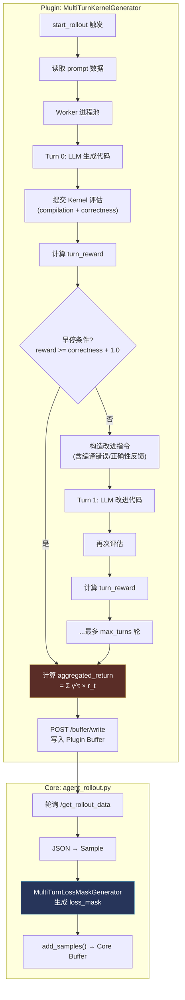
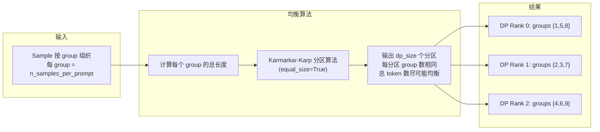

# Core Buffer 与 Plugin RolloutBuffer 的交互关系

## 一句话总结

**它们不直接交互。** [agent_rollout.py](file:///home/robomaster/Research/TritonForge/SLIME/slime/rollout/agent_rollout.py) 是桥梁，从 Plugin RolloutBuffer（HTTP 服务器）拉取数据，转换后写入 Core Buffer（Ray Actor）。

## 架构对比

| 维度 | Core Buffer | Plugin RolloutBuffer |
|------|-------------|---------------------|
| **文件** | [buffer.py](file:///home/robomaster/Research/TritonForge/SLIME/slime/ray/buffer.py) | [buffer.py](file:///home/robomaster/Research/TritonForge/SLIME/slime_plugins/rollout_buffer/buffer.py) |
| **运行方式** | Ray Remote Actor（进程内调用） | FastAPI HTTP Server（独立进程，端口 8889） |
| **职责** | 管理 prompt 取样 + 存储训练数据 | 接收推理结果 + 分组/过滤/归一化/补齐 |
| **数据格式** | `Sample` 对象 → `dict{tokens, rewards, ...}` | 原始推理 JSON（含 messages, reward, instance_id） |
| **使用场景** | 所有训练模式 | 仅 [agent_rollout](file:///home/robomaster/Research/TritonForge/SLIME/slime/rollout/agent_rollout.py#225-315) 模式（异步外部推理） |

## 交互拓扑图



## 为什么需要两个 Buffer？

> [!IMPORTANT]
> Plugin RolloutBuffer 解决的是 **异步、多进程、长时间运行的外部推理任务**（如 Agent 多轮对话、代码执行验证）。这类任务耗时不一，结果需要按 `instance_id` 分组、等待超时、过滤无效结果、归一化奖励后才能用于训练。Core Buffer 不具备这些能力。

| 问题 | Core Buffer 方案 | Plugin RolloutBuffer 方案 |
|------|-----------------|-------------------------|
| 推理耗时不一 | 同步等待所有结果 | 异步累积，按组超时判定 |
| 结果需分组 | 简单 `n_samples_per_prompt` 分组 | 按 `instance_id` 自动分组 + 超时 |
| 无效结果过滤 | 无 | `filter_item()` + [is_valid_group()](file:///home/robomaster/Research/TritonForge/SLIME/slime_plugins/rollout_buffer/generator/base_generator.py#322-344) |
| 奖励归一化 | GRPO 级别的简单 group norm | 任务定制化 [normalize_group_data()](file:///home/robomaster/Research/TritonForge/SLIME/slime_plugins/rollout_buffer/generator/base_generator.py#292-320) |
| 结果不足时补齐 | 无 | `pad_group_data()` 补到 `group_size` |

## 详细时序图



## 数据转换链路

```
Plugin 侧 (JSON):
{
  "uid": "xxx",
  "instance_id": "problem_001",
  "messages": [{role, content}, ...],     ← 对话历史
  "reward": 0.85,                         ← 已归一化的奖励
  "raw_reward": 1.0,                      ← 原始奖励
  "extra_info": {timestamp, round_number, ...}
}
        │
        │ agent_rollout.py 转换
        ▼
Core Buffer 侧 (Sample):
Sample(
  index = instance_id,
  prompt = uid,
  tokens = tokenizer.encode(messages),    ← tokenize 完整对话
  response_length = ...,                  ← 从 loss_mask 计算
  reward = 0.85,
  loss_mask = [...],                      ← MultiTurnLossMaskGenerator 生成
  metadata = {raw_reward: 1.0, ...}
)
        │
        │ _convert_samples_to_train_data()
        ▼
训练数据 (dict):
{
  "tokens": [[token_ids], ...],
  "response_lengths": [int, ...],
  "rewards": [float, ...],
  "loss_masks": [[0,0,1,1,...], ...],
  "truncated": [0, ...],
}
```

## 关键代码位置

| 步骤 | 代码位置 |
|------|---------|
| agent_rollout 调用 [start_rollout](file:///home/robomaster/Research/TritonForge/SLIME/slime/rollout/agent_rollout.py#186-223) | [agent_rollout.py:186-222](file:///home/robomaster/Research/TritonForge/SLIME/slime/rollout/agent_rollout.py#L186-L222) |
| agent_rollout 轮询 [get_rollout_data](file:///home/robomaster/Research/TritonForge/SLIME/slime/ray/ppo_actor.py#251-255) | [agent_rollout.py:133-183](file:///home/robomaster/Research/TritonForge/SLIME/slime/rollout/agent_rollout.py#L133-L183) |
| agent_rollout 转换 JSON → Sample | [agent_rollout.py:287-308](file:///home/robomaster/Research/TritonForge/SLIME/slime/rollout/agent_rollout.py#L287-L308) |
| Plugin 接收 `/start_rollout` | [plugin buffer.py:640-644](file:///home/robomaster/Research/TritonForge/SLIME/slime_plugins/rollout_buffer/buffer.py#L640-L644) |
| Plugin 返回 `/get_rollout_data` | [plugin buffer.py:450-487](file:///home/robomaster/Research/TritonForge/SLIME/slime_plugins/rollout_buffer/buffer.py#L450-L487) |
| BaseGenerator 写入 plugin buffer | [base_generator.py:161-177](file:///home/robomaster/Research/TritonForge/SLIME/slime_plugins/rollout_buffer/generator/base_generator.py#L161-L177) |

---

## 补充一：同步模式下的具体表现

在同步模式（使用 `sglang_example` rollout 函数）下，**不涉及 Plugin RolloutBuffer**，Core Buffer 独立完成所有工作。

### 同步模式时序



### 同步 vs 异步训练循环对比

| 维度 | `train.py` (同步) | `train_async.py` (异步) |
|------|-------------------|------------------------|
| **Rollout 与 Train 的关系** | 严格串行：`ray.get(generate)` → `ray.get(train)` → `ray.get(update_weights)` | 流水线：Train(rollout_id) **同时** Generate(rollout_id+1) |
| **权重更新频率** | 每步更新 | 可配置 `update_weights_interval`，N 步更新一次 |
| **数据新鲜度** | 每次训练用"最新权重"生成的数据 | 可能用"延迟 N 步"的权重生成的数据 |
| **GPU 利用率** | 推理 GPU 在训练时空闲，训练 GPU 在推理时空闲 | 推理与训练可重叠，GPU 利用率更高 |
| **Offload 支持** | 支持 (offload → train → onload) | 不支持 colocation 模式 |

> [!NOTE]
> 同步模式中的 `sglang_example` 内部仍使用 **asyncio** 进行并发推理（通过 `asyncio.Semaphore` 控制并发数），只是对 `train.py` 主循环而言是阻塞的。

---

## 补充二：Multi-Turn 训练的具体细节

Multi-turn 场景（如 KernelBench 多轮代码优化）涉及 **Plugin RolloutBuffer** + **Core Buffer** 的完整交互链路。

### Multi-Turn 数据生成流程



### 关键机制

#### 1. Gamma-Discounted Aggregated Return

每个 instance 跨多轮（`max_turns`，默认 3），每轮有独立 reward：

```
aggregated_return = Σ (γ^t × r_t)     其中 γ = 0.4 (默认)
```

**示例**：`turn_rewards = [0.3, 0.8, 1.5]`
- `return = 0.4^0 × 0.3 + 0.4^1 × 0.8 + 0.4^2 × 1.5 = 0.3 + 0.32 + 0.24 = 0.86`

> [!TIP]
> γ < 1 意味着**早期轮次的 reward 权重更高**，鼓励模型"一次做对"而非依赖多轮迭代。

#### 2. Multi-Turn Loss Mask

[MultiTurnLossMaskGenerator](file:///home/robomaster/Research/TritonForge/SLIME/slime/utils/mask_utils.py#L6-L165) 为多轮对话生成 token 级别的 loss mask：

```
messages = [user, assistant, user, assistant, ...]
                    ↓                    ↓
loss_mask = [0,0,...,0, 1,1,...,1, 0,0,...,0, 1,1,...,1]
                        ↑ 只训练 assistant 回复 ↑
```

支持的 tokenizer 类型：
- **qwen**: 逐消息 `apply_chat_template`，精确定位 assistant token 边界
- **distill_qwen**: 只取最后一轮 assistant 回复
- **llama/kernelllm**: 增量方式计算每轮消息的 token 范围

#### 3. 训练时 Multi-Turn 日志

`megatron_utils.data.log_multi_turn_data()` 在训练侧记录：
- `raw_response_length`：含 observation 的完整 response 长度统计
- `wo_obs_response_length`：去掉 observation（`loss_mask=0`）的实际训练 token 长度
- `round_number`：每个 sample 的对话轮次数

---

## 补充三：不等长（长尾）训练数据的优化

多轮对话天然产生 **长尾分布** 的序列长度（1 轮可能 512 token，3 轮可能 8192 token）。SLIME 从三个层面优化：

### 1. DP Rank 间的序列长度均衡

问题：如果简单按 round-robin 分配 sample 到各 DP rank，某个 rank 可能分到所有长序列，导致显存 OOM。

解决方案（`args.balance_data=True`）：



> [!IMPORTANT]
> **分组感知**：分区以 `n_samples_per_prompt` 为单位（一个 group 内的 sample 共享同一 prompt），保证同组 sample 分到同一 DP rank。这对 GRPO 的 group-level 奖励归一化至关重要。

### 2. Dynamic Batch Size (动态 Micro-Batch 划分)

问题：固定 `micro_batch_size` 时，一个 micro-batch 可能包含一条 8192-token 序列，显存爆炸。

解决方案（`args.use_dynamic_batch_size=True` + `args.max_tokens_per_gpu`）：

```
传统固定 batch:     每个 micro-batch = N 条 sample (不管长短)
动态 batch:         每个 micro-batch ≤ max_tokens_per_gpu 个 token (变长)
```

具体实现（[megatron_utils/data.py](file:///home/robomaster/Research/TritonForge/SLIME/slime/backends/megatron_utils/data.py#L148-L247)）：

1. **First-Fit 算法** 计算每个 train step 最少需要多少 micro-batch
2. **All-reduce MAX** 跨 DP rank 统一 micro-batch 数（保证前向/后向步数一致）
3. **Karmarkar-Karp 分区** 对每个 step 的样本进行序列长度均衡分配到各 micro-batch
4. 同样应用于 log_probs 计算阶段

### 3. Packed Sequence (VarLen Attention)

所有 sample 拼接为一个长序列，使用 `cu_seqlens` 记录每条样本的边界：

```
tokens:    [s1_tok1, s1_tok2, ..., s2_tok1, s2_tok2, ..., pad, pad]
cu_seqlens: [0,       len(s1),     len(s1)+len(s2),    ..., total+pad]
```

配合 FlashAttention 的 `PackedSeqParams(qkv_format="thd")`，避免 padding 浪费。总长度对齐到 128 的倍数以减少显存碎片。

### 优化效果总结

| 优化手段 | 解决的问题 | 关键参数 | 代码位置 |
|---------|-----------|---------|---------|
| 序列长度均衡 | DP rank 间负载不均 | `args.balance_data` | [data.py:289-319](file:///home/robomaster/Research/TritonForge/SLIME/slime/backends/megatron_utils/data.py#L289-L319) |
| 动态 micro-batch | 长序列 OOM | `args.use_dynamic_batch_size`, `args.max_tokens_per_gpu` | [data.py:163-247](file:///home/robomaster/Research/TritonForge/SLIME/slime/backends/megatron_utils/data.py#L163-L247) |
| Packed Sequence | padding 浪费 | 默认启用 | [data.py:46-103](file:///home/robomaster/Research/TritonForge/SLIME/slime/backends/megatron_utils/data.py#L46-L103) |
| Karmarkar-Karp 分区 | NP-hard 均衡问题的高效近似 | 内部使用 | [seqlen_balancing.py](file:///home/robomaster/Research/TritonForge/SLIME/slime/utils/seqlen_balancing.py) |
