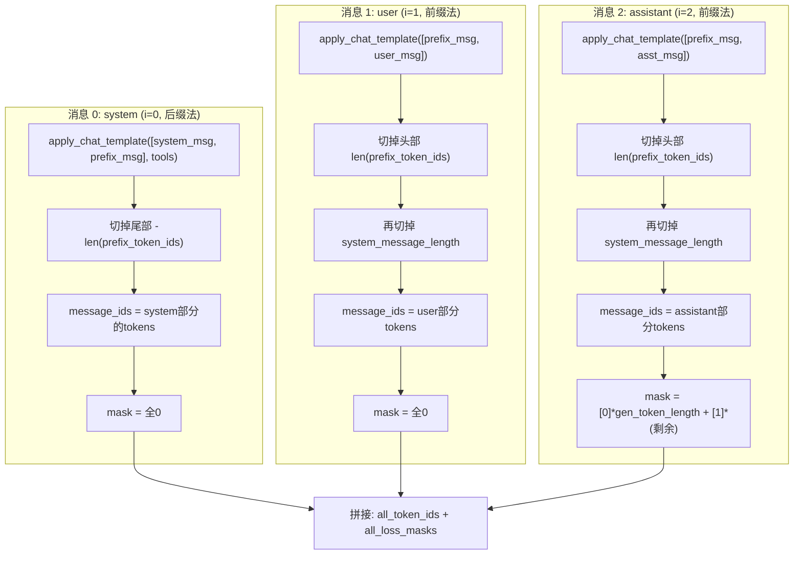

# SLIME / SLIME2 多轮对话 Loss Mask 生成详解

## 1. 多轮对话输入格式

**数据来源证据**：[agent_rollout.py#L346](file:///home/robomaster/Research/TritonForge/SLIME/slime/rollout/agent_rollout.py#L346)

输入 `messages` 是标准 **OpenAI 格式消息列表**（`List[Dict]`），每条 dict 包含 `role` + `content`，在 SLIME2 中还可能有 `tool_calls`、`step_loss_mask` 等字段。

典型输入（来自 [test_mask_utils.py#L29-L43](file:///home/robomaster/Research/TritonForge/SLIME2/tests/utils/test_mask_utils.py#L29-L43)）：

```python
# 简单多轮
messages = [
    {"role": "system",    "content": "SYSTEM MESSAGE FOR TESTING ONLY"},
    {"role": "user",      "content": "USER CONTENT FOR TESTING ONLY"},
    {"role": "assistant", "content": "ASSISTANT RESPONSE FOR TESTING ONLY"},
]

# 带工具调用的多轮 (SLIME2)
messages = [
    {"role": "system",    "content": "SYSTEM MESSAGE"},
    {"role": "user",      "content": "USER CONTENT"},
    {"role": "assistant", "content": "I WILL CALL terminal",
     "tool_calls": [{"function": {"name": "terminal", "arguments": {"command": "ls"}}, ...}]},
    {"role": "tool",      "name": "terminal", "content": "LICENSE  README.md"},
    {"role": "assistant", "content": "FINAL RESPONSE"},
]
```

---

## 2. 共同基础：[get_system_message_length](file:///home/robomaster/Research/TritonForge/SLIME/slime/utils/mask_utils.py#29-50)

**源码**：[SLIME mask_utils.py#L29-L49](file:///home/robomaster/Research/TritonForge/SLIME/slime/utils/mask_utils.py#L29-L49) / [SLIME2 mask_utils.py#L26-L50](file:///home/robomaster/Research/TritonForge/SLIME2/slime/utils/mask_utils.py#L26-L50)

两个版本**完全相同**。用"双消息探测法"推导两个常量：

```python
test_messages = [
    {"role": "user", "content": "FOR TESTING ONLY"},
    {"role": "user", "content": "FOR TESTING ONLY"},
]
```

```
apply_chat_template(test_messages) 产生：
┌──────────────────────┬───────────────┬──────────────────┬───────────────┬──────────────┐
│ default_system_tokens│ msg1_overhead │ raw_test_tokens  │ msg2_overhead │ raw + end    │
│ (默认系统消息)        │ (<|im_start|> │ "FOR TESTING     │ (<|im_start|> │              │
│                      │  user\n)       │  ONLY"           │  user\n)       │              │
├──────────────────────┴───────────────┴──────────────────┴───────────────┴──────────────┤
│ 0                    idx_1           idx_1+len(raw)     idx_2           len(total)     │
└───────────────────────────────────────────────────────────────────────────────────────────┘
```

- `overhead = (idx_2 - idx_1) - end_interval - len(raw)` → 每条消息的格式开销
- `system_message_length = idx_1 - overhead` → 默认 system prompt 的 token 数量
- `gen_token_length` → `<|im_start|>assistant\n` 的 token 数量（生成提示符）

---

## 3. SLIME [gen_multi_turn_loss_mask_qwen](file:///home/robomaster/Research/TritonForge/SLIME/slime/utils/mask_utils.py#51-70)（旧版）

**源码**：[SLIME mask_utils.py#L51-L69](file:///home/robomaster/Research/TritonForge/SLIME/slime/utils/mask_utils.py#L51-L69)

**策略**：对每条消息单独 `apply_chat_template([msg])` → 截掉多余 system 前缀 → 拼接。

```python
for i, message in enumerate(messages):
    message_ids = tokenizer.apply_chat_template([message], tokenize=True)
    if message["role"] != "system" and i > 0:
        message_ids = message_ids[system_message_length:]  # 截掉默认system
    # assistant → 前gen_token_length个0 + 其余全1
    # 其他 → 全0
```

> [!NOTE]
> 该方法假定 `apply_chat_template([单条消息])` 的输出结构是 `[系统前缀] + [角色头] + [内容] + [结尾]`，只需简单截掉固定长度的系统前缀即可。

---

## 4. SLIME2 [gen_multi_turn_loss_mask_qwen3](file:///home/robomaster/Research/TritonForge/SLIME2/slime/utils/mask_utils.py#82-129)（新版，核心）

**源码**：[SLIME2 mask_utils.py#L82-L128](file:///home/robomaster/Research/TritonForge/SLIME2/slime/utils/mask_utils.py#L82-L128)

### 4.1 为什么需要新方法？

Qwen3 模板与 Qwen2.5 的关键差异：
- Qwen3 有 **`<think>...</think>` 推理块**，模板结构更复杂
- Qwen3 对**纯 assistant 消息**单独做 `apply_chat_template` 时，可能产生与多轮拼接不一致的结果（如 thinking token 的处理）
- 消息类型更丰富（tool_calls、tool response），简单截取固定前缀可能出错

### 4.2 核心策略："配对消息差分法"

**不再**单独 tokenize 单条消息后截取，而是通过**附加一个已知的 dummy 消息**来精确差分出目标消息的 token。

```python
# 预先计算 dummy 消息的完整 token 序列（包含默认系统前缀）
prefix_message = {"role": "user", "content": "FOR CALCULATING LOSS MASK ONLY"}
prefix_token_ids = tokenizer.apply_chat_template([prefix_message], tokenize=True)
```

#### 4.2.1 第 0 条消息（i==0）：后缀法

```python
tailed_message_ids = tokenizer.apply_chat_template(
    [message, prefix_message],  # 目标消息 + dummy 消息
    tokenize=True, tools=tools,
)
message_ids = tailed_message_ids[:-len(prefix_token_ids)]  # 切掉尾巴
```

**图解**：

```
apply_chat_template([msg_0, prefix_message]) 产生：

┌───────────────────────────────────────┬──────────────────────────────────────┐
│           msg_0 的完整 token          │  prefix_message 的完整 token          │
│  (包含 system 行为 + 内容 + 结尾)      │  (与 prefix_token_ids 相同)           │
└───────────────────────────────────────┴──────────────────────────────────────┘
├────────── 我们想要的部分 ──────────────┤├──── 切掉 -len(prefix_token_ids) ────┤
```

> [!IMPORTANT]
> **为什么需要后缀法？** 因为 Qwen3 模板中，如果**只有一条 assistant 消息**，模板可能会按终结方式处理（比如不加 `<|im_end|>` 或改变结束行为）。加上一个后续 user 消息后，模板会正确地给第 0 条消息添加完整的结束标记。
>
> **同时**，第 0 条消息可能要承载 [tools](file:///home/robomaster/Research/TritonForge/SLIME2/tests/utils/test_mask_utils.py#26-95) 参数（工具定义会被注入到 system prompt 中），因此第 0 条消息需要传入 `tools=tools`。

#### 4.2.2 后续消息（i>0）：前缀法

```python
prefixed_message_ids = tokenizer.apply_chat_template(
    [prefix_message, message],  # dummy 消息 + 目标消息
    tokenize=True,
)
message_ids = prefixed_message_ids[len(prefix_token_ids):]  # 切掉头部
```

**图解**：

```
apply_chat_template([prefix_message, msg_i]) 产生：

┌──────────────────────────────────────┬───────────────────────────────────────┐
│  prefix_message 的完整 token          │           msg_i 的 token              │
│  (与 prefix_token_ids 相同)           │  (含默认sys前缀 + 角色头 + 内容)       │
└──────────────────────────────────────┴───────────────────────────────────────┘
├──── 切掉 len(prefix_token_ids) ──────┤├────────── 我们想要的部分 ────────────┤
```

> [!IMPORTANT]
> **为什么需要前缀法？** 这保证了目标消息在模板中处于**非首个**位置，模板会像处理真实多轮对话中的后续消息一样来格式化它（例如，正确处理 assistant 的 `<|im_start|>assistant\n` 头部和 `<|im_end|>` 结尾），而不是作为"唯一消息"的特殊处理。

#### 4.2.3 后续消息的 system 截取（与旧版相同）

如果 `i > 0` 且 `role != "system"`，还会进一步截掉 [system_message_length](file:///home/robomaster/Research/TritonForge/SLIME/slime/utils/mask_utils.py#29-50)：

```python
if message["role"] != "system" and i > 0:
    message_ids = message_ids[self.system_message_length:]
```

这一步与旧版逻辑一致，因为从**前缀法**提取出的 `message_ids` 仍然包含模板自动插入的默认 system tokens。

### 4.3 完整流程图

以 3 条消息 `[system, user, assistant]` 为例：



### 4.4 `step_loss_mask` 字段（SLIME2 新增）

**源码**：[SLIME2 mask_utils.py#L122-L123](file:///home/robomaster/Research/TritonForge/SLIME2/slime/utils/mask_utils.py#L122-L123)

```python
if message.get("step_loss_mask", 1) != 1:
    loss_mask = [0] * len(message_ids)  # 强制全 0
```

当某条消息设置了 `"step_loss_mask": 0` 时，即使是 assistant 回复也会被**完全排除出训练**。这用于多轮 agent 训练中，可以选择性地只训练某些轮次的回复。

---

## 5. Qwen vs Qwen3 对比

| 特性 | SLIME [qwen](file:///home/robomaster/Research/TritonForge/SLIME2/tests/utils/test_mask_utils.py#26-95) | SLIME2 [qwen3](file:///home/robomaster/Research/TritonForge/SLIME2/tests/utils/test_mask_utils.py#26-95) |
|------|-------------|-----------------|
| 源码 | [mask_utils.py#L51-L69](file:///home/robomaster/Research/TritonForge/SLIME/slime/utils/mask_utils.py#L51-L69) | [mask_utils.py#L82-L128](file:///home/robomaster/Research/TritonForge/SLIME2/slime/utils/mask_utils.py#L82-L128) |
| 消息提取策略 | 直接 `apply_chat_template([msg])` + 截 system 前缀 | 用 dummy 消息配对差分 |
| 第 0 条处理 | 保留完整输出 | **后缀法**：`[msg, dummy]` 截尾 |
| 后续消息处理 | 截 [system_message_length](file:///home/robomaster/Research/TritonForge/SLIME/slime/utils/mask_utils.py#29-50) | **前缀法**：`[dummy, msg]` 截头 + 截 system |
| tools 支持 | ❌ | ✅ 第 0 条传 [tools](file:///home/robomaster/Research/TritonForge/SLIME2/tests/utils/test_mask_utils.py#26-95) 参数 |
| `step_loss_mask` | ❌ | ✅ 可选择性跳过某轮 |
| [tool](file:///home/robomaster/Research/TritonForge/SLIME2/tests/utils/test_mask_utils.py#26-95) role 支持 | ❌ | ✅ tool 消息 mask=全0 |

---

## 6. 设计意图总结

| 设计决策 | 原因 |
|---------|------|
| **dummy 配对差分（Qwen3）** | 避免单条消息 tokenize 时模板的"边界效应"（首条/末条消息的特殊处理） |
| **后缀法用于第 0 条** | 确保第 0 条消息有正确的结束标记，且能注入 tools 定义 |
| **前缀法用于后续消息** | 让目标消息在非首位置、获得正常的多轮格式化 |
| [system_message_length](file:///home/robomaster/Research/TritonForge/SLIME/slime/utils/mask_utils.py#29-50) 截取 | 两版共用：去除 `apply_chat_template` 自动添加的默认 system prompt |
| `gen_token_length` 个 0 | `<\|im_start\|>assistant\n` 是格式标记，不参与损失计算 |
| `step_loss_mask` | 多轮 agent 训练中选择性跳过中间轮次的回复 |
