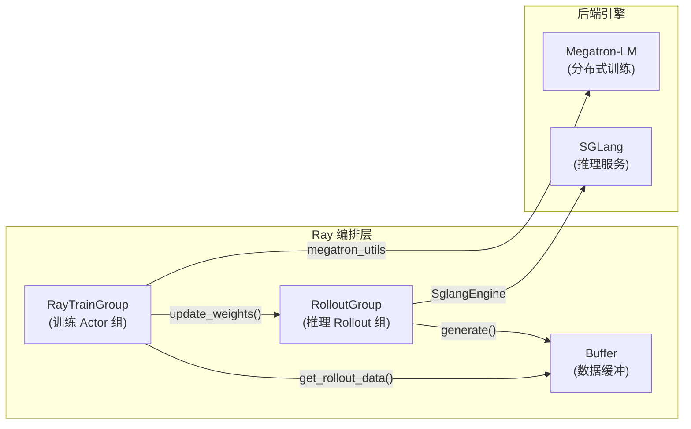
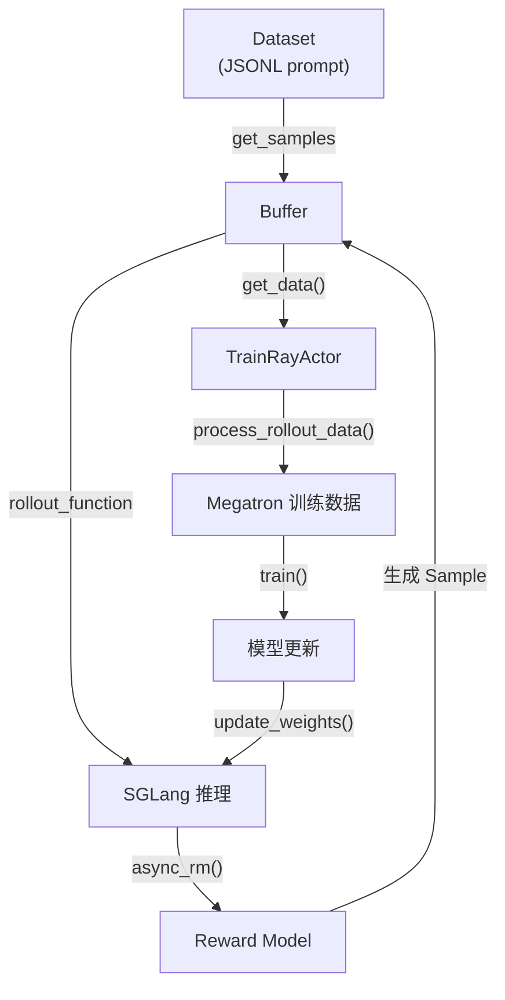

# SLIME 代码阅读指南：从零开始

> **SLIME** = **S**calable **L**anguage model **I**mprovement by **M**erit-based **E**xploration
> 一个基于 Ray + Megatron-LM + SGLang 的 LLM 强化学习训练框架，TritonForge 版本专注于 GPU Kernel 生成任务。

---

## 一、总览：三句话理解 SLIME

1. **Megatron-LM** 负责分布式模型训练（TP/PP/DP 并行），是「大脑」。
2. **SGLang** 负责高性能推理采样（Rollout 生成），是「嘴巴」。
3. **Ray** 是「指挥官」，协调 Megatron 训练 Actor 和 SGLang 推理引擎，按 PPO/GRPO 训练循环驱动两者交替工作。



---

## 二、推荐阅读顺序

按「从顶向下」分 **5 层** 阅读，每层建议花 **20-30 分钟**。

### 🔵 第 1 层：入口与训练循环（最先读）

| 文件 | 核心内容 | 重要程度 |
|------|----------|---------|
| [train.py](file:///home/robomaster/Research/TritonForge/SLIME/train.py) | **同步训练循环** — 理解整个流程的最佳起点 | ⭐⭐⭐⭐⭐ |
| [train_async.py](file:///home/robomaster/Research/TritonForge/SLIME/train_async.py) | **异步训练循环** — 推理和训练可并行 | ⭐⭐⭐⭐ |

**关键阅读要点：**

`train.py` 仅 82 行，却完整展示了 RL 训练主循环：

```
1. create_placement_groups(args)     → 分配 GPU 资源
2. create_actor_group(args, pg)      → 创建训练 Actor（Megatron）
3. create_rollout_group(args, pg)    → 创建推理 Rollout（SGLang）
4. actor_model.async_init()          → 初始化模型+优化器
5. actor_model.async_init_weight_update_connections() → 建立权重同步通道
6. actor_model.async_update_weights()   → 首次同步权重到 SGLang

训练循环（每个 rollout_id）:
  ├── rollout_generator.async_generate()  → SGLang 推理采样
  ├── actor_model.async_train()           → Megatron 执行梯度更新
  ├── actor_model.async_save_model()      → （可选）保存检查点
  └── actor_model.async_update_weights()  → 同步新权重到 SGLang
```

> [!TIP]
> `train_async.py` 的关键区别：它把 `async_generate(rollout_id+1)` 提前启动，使得下一轮推理与当前训练并行，从而提升吞吐。

---

### 🟢 第 2 层：Ray 编排（核心架构）

| 文件 | 核心内容 | 重要程度 |
|------|----------|---------|
| [placement_group.py](file:///home/robomaster/Research/TritonForge/SLIME/slime/ray/placement_group.py) | GPU 资源分配与 Placement Group 创建 | ⭐⭐⭐⭐ |
| [ppo_actor.py](file:///home/robomaster/Research/TritonForge/SLIME/slime/ray/ppo_actor.py) | `TrainRayActor`（单卡训练逻辑）+ `RayTrainGroup`（多卡协调） | ⭐⭐⭐⭐⭐ |
| [rollout.py](file:///home/robomaster/Research/TritonForge/SLIME/slime/ray/rollout.py) | `RolloutRayActor` + `RolloutGroup` + SGLang Router | ⭐⭐⭐⭐⭐ |
| [buffer.py](file:///home/robomaster/Research/TritonForge/SLIME/slime/ray/buffer.py) | `Buffer` — 数据缓冲 Actor，连接推理与训练 | ⭐⭐⭐⭐ |

**关键阅读要点：**

#### `ppo_actor.py` — TrainRayActor（671 行，最复杂的文件）

```
TrainRayActor（单个训练 GPU Worker）
├── init()               → Megatron 初始化 + 模型加载
├── train()              → 一轮训练：数据获取 → ref log_prob → actor log_prob → 优势计算 → 梯度更新
├── update_weights()     → 训练后同步权重到 SGLang
│   ├── update_weights_from_distributed()  → 非 colocate：broadcast weights via NCCL
│   └── update_weights_from_tensor()       → colocate：IPC 共享显存
└── connect_rollout_engines()  → 建立 Megatron ↔ SGLang 的通信通道

RayTrainGroup（多 Worker 的包装器）
├── 每个方法加 async_ 前缀
└── 内部实际就是 [actor.xxx.remote() for actor in actors]
```

> [!IMPORTANT]
> `TrainRayActor.train()` 是关键方法（L278-L348），它展示了 PPO/GRPO 单步训练的完整流程：
> 获取 rollout 数据 → 计算 ref/actor log_prob → 计算 advantage → 执行训练步 → 日志记录

#### `rollout.py` — RolloutGroup

```
RolloutGroup
├── start_router()       → 启动 SGLang Router（多引擎负载均衡）
├── data_buffer          → Buffer Actor（管理采样数据）
├── rollout_engines      → 多个 RolloutRayActor（SGLang Worker）
└── async_generate()     → 委托给 data_buffer.generate()
```

#### `buffer.py` — Buffer

```
Buffer（Ray Actor，运行在 CPU 上）
├── generate()          → 调用用户定义的 rollout 函数生成数据
├── get_samples()       → 从 buffer/dataset 获取 prompt 样本
├── _set_data()         → 存储训练数据到 data_pool
├── get_data()          → 训练 Actor 拉取数据
└── _convert_samples_to_train_data()  → Sample→训练格式转换
```

> [!NOTE]
> Buffer 通过 `generate_rollout = load_function(args.rollout_function_path)` 动态加载用户自定义的 rollout 函数，实现插件化。

---

### 🟡 第 3 层：后端引擎接口

| 文件 | 核心内容 | 重要程度 |
|------|----------|---------|
| [megatron_utils/\_\_init\_\_.py](file:///home/robomaster/Research/TritonForge/SLIME/slime/backends/megatron_utils/__init__.py) | Megatron 功能汇总（init/train/save/loss/data） | ⭐⭐⭐ |
| [megatron_utils/model.py](file:///home/robomaster/Research/TritonForge/SLIME/slime/backends/megatron_utils/model.py) | `initialize_model_and_optimizer()`, `train()`, `forward_only()` | ⭐⭐⭐⭐ |
| [megatron_utils/loss.py](file:///home/robomaster/Research/TritonForge/SLIME/slime/backends/megatron_utils/loss.py) | PPO/SFT loss + advantage 计算（GRPO） | ⭐⭐⭐⭐ |
| [megatron_utils/data.py](file:///home/robomaster/Research/TritonForge/SLIME/slime/backends/megatron_utils/data.py) | Rollout 数据 → Megatron 训练数据转换 | ⭐⭐⭐ |
| [megatron_utils/update_weight_utils.py](file:///home/robomaster/Research/TritonForge/SLIME/slime/backends/megatron_utils/update_weight_utils.py) | Megatron→HuggingFace 参数转换（权重同步核心） | ⭐⭐⭐⭐ |
| [sglang_utils/sglang_engine.py](file:///home/robomaster/Research/TritonForge/SLIME/slime/backends/sglang_utils/sglang_engine.py) | SGLang 引擎封装（103 行，简洁） | ⭐⭐⭐ |

**关键阅读要点：**

- `megatron_utils` 是 Megatron-LM 的薄封装层，隔离上层 Ray 编排与底层 Megatron API
- `update_weight_utils.py` 是技术含量最高的文件（34K），处理 Megatron 内部参数格式 → HF 格式转换
- `sglang_engine.py` 仅 103 行，核心就是创建 `HttpServerEngineAdapter` 并暴露权重更新/推理控制接口

---

### 🟠 第 4 层：Rollout 与奖励系统

| 文件 | 核心内容 | 重要程度 |
|------|----------|---------|
| [sglang_example.py](file:///home/robomaster/Research/TritonForge/SLIME/slime/rollout/sglang_example.py) | **标准 rollout 函数**（数学推理场景） | ⭐⭐⭐⭐⭐ |
| [agent_rollout.py](file:///home/robomaster/Research/TritonForge/SLIME/slime/rollout/agent_rollout.py) | **Agent rollout**（外部 buffer 服务器，多轮 kernel 生成） | ⭐⭐⭐⭐ |
| [rm_hub/\_\_init\_\_.py](file:///home/robomaster/Research/TritonForge/SLIME/slime/rollout/rm_hub/__init__.py) | 奖励模型调度（规则RM/远程RM/自定义RM） | ⭐⭐⭐ |
| [filter_hub/](file:///home/robomaster/Research/TritonForge/SLIME/slime/rollout/filter_hub) | 动态采样过滤器（DAPO 风格） | ⭐⭐ |

**关键阅读要点：**

`sglang_example.py` 展示了标准 rollout 的完整流程：

```
generate_rollout()
└── generate_rollout_async()
    ├── (1) 从 Buffer.get_samples() 获取 prompt
    ├── (2) 提交异步生成任务 → SGLang Router → 推理引擎
    ├── (3) 获取响应后计算 reward
    ├── (4) 可选：dynamic_filter（DAPO）过滤无效样本
    ├── (5) 可选：over_sampling_filter 过采样后筛选
    └── (6) 返回 list[list[Sample]]
```

`agent_rollout.py` 是 TritonForge 特有的，通过外部 buffer 服务器管理 kernel 生成轨迹，支持多轮交互。

---

### 🔴 第 5 层：TritonForge 插件（Kernel 生成专用）

| 文件 | 核心内容 | 重要程度 |
|------|----------|---------|
| [base_generator.py](file:///home/robomaster/Research/TritonForge/SLIME/slime_plugins/rollout_buffer/generator/base_generator.py) | 基础生成器（多进程 worker pool） | ⭐⭐⭐ |
| [kernel_generator.py](file:///home/robomaster/Research/TritonForge/SLIME/slime_plugins/rollout_buffer/generator/kernel_generator.py) | 单轮 Triton kernel 生成 | ⭐⭐⭐⭐ |
| [multi_turn_kernel_generator.py](file:///home/robomaster/Research/TritonForge/SLIME/slime_plugins/rollout_buffer/generator/multi_turn_kernel_generator.py) | **多轮迭代 kernel 优化生成**（核心创新） | ⭐⭐⭐⭐⭐ |
| [rollout_buffer/buffer.py](file:///home/robomaster/Research/TritonForge/SLIME/slime_plugins/rollout_buffer/buffer.py) | 外部 buffer 服务（Flask HTTP API） | ⭐⭐⭐ |
| [kernelbench_config.py](file:///home/robomaster/Research/TritonForge/SLIME/slime_plugins/rollout_buffer/generator/kernelbench_config.py) | Kernel 评估奖励配置 | ⭐⭐⭐ |

**关键阅读要点：**

`slime_plugins/` 是 TritonForge fork 独有的扩展层。多轮 kernel 生成的流程：

```
Turn 0: PyTorch 代码 → LLM 生成初始 Triton kernel → 编译评估
Turn 1: 初始 kernel + 错误反馈 → LLM 修正 → 重新评估
Turn 2: 可工作 kernel + 性能指标 → LLM 优化 → 最终评估

每轮 reward 通过 γ=0.4 的折扣因子聚合：
return_t0 = r0 + γ·r1 + γ²·r2
```

---

## 三、核心数据结构

### Sample — 贯穿整个系统的数据单元

```python
# file: slime/utils/types.py
@dataclass
class Sample:
    index: int                          # 样本索引
    prompt: str | list[dict]            # 提示（文本或 OpenAI 消息格式）
    tokens: list[int]                   # 完整 token 序列（prompt + response）
    response: str                       # 生成的文本响应
    response_length: int                # 响应 token 数
    label: str                          # 参考答案
    reward: float | dict[str, float]    # 奖励值
    loss_mask: list[int]                # 训练 loss 掩码
    status: Status                      # PENDING/COMPLETED/TRUNCATED/ABORTED
    metadata: dict                      # 附加元信息

    # 多轮支持  
    turn_idx: int                       # 当前轮次
    history: list[dict]                 # 历史轮次
    turn_rewards: list[float]           # 各轮奖励
    aggregated_return: float            # 折扣累积回报
```

### 数据流转路径



---

## 四、参数系统速查

参数系统定义在 [arguments.py](file:///home/robomaster/Research/TritonForge/SLIME/slime/utils/arguments.py)（1009 行），分为以下几组：

| 参数组 | 前缀/关键词 | 典型参数 |
|--------|-----------|---------|
| 集群配置 | `--actor-*`, `--rollout-*`, `--colocate` | `--actor-num-gpus-per-node 4`, `--rollout-num-gpus 2` |
| 推理参数 | `--rollout-*` | `--rollout-temperature 0.8`, `--rollout-max-response-len 8192` |
| 数据配置 | `--prompt-data`, `--rollout-batch-size` | `--n-samples-per-prompt 8`, `--global-batch-size 128` |
| 算法参数 | `--eps-clip`, `--kl-coef`, `--loss-type` | `--advantage-estimator grpo`, `--use-kl-loss` |
| Agent/多轮 | `--agent-rollout-buffer-url`, `--max-turns` | `--gamma 0.4`, `--rollout-task-type kernelbench_multiturn` |
| 调试 | `--debug-*` | `--debug-rollout-only`, `--save-debug-rollout-data` |

---

## 五、关键机制深度理解

### 1. 权重同步（Megatron → SGLang）

这是 SLIME 最精妙的工程，有两种模式：

| 模式 | 适用场景 | 实现方式 |
|-----|---------|---------|
| **Distributed**（非 colocate） | 训练和推理在不同 GPU | NCCL broadcast: Megatron rank 0 → SGLang 各 worker |
| **Tensor**（colocate） | 训练和推理共享 GPU | CUDA IPC 共享显存，无需数据拷贝 |

读代码时重点关注 `ppo_actor.py` 中的：
- `connect_rollout_engines()` — 建立通信通道
- `update_weights_from_distributed()` — 非 colocate 路径
- `update_weights_from_tensor()` — colocate 路径（+CuMemAllocator 管理显存）

### 2. 插件化设计

SLIME 通过 `load_function(path_string)` 实现运行时加载：

```python
# 以下参数都是「函数路径」，运行时动态导入
--rollout-function-path        # 自定义 rollout 逻辑
--eval-function-path           # 自定义评估逻辑
--custom-rm-path               # 自定义奖励模型
--custom-loss-function-path    # 自定义 loss
--dynamic-sampling-filter-path # 动态采样过滤
--buffer-filter-path           # Buffer 采样策略
```

### 3. 同步 vs 异步训练

```
同步（train.py）:
  generate(t) → train(t) → update_weights → generate(t+1) → ...
  ┃━━━━━━┃    ┃━━━━━━━┃   ┃━━━━━━━━━━━━━━┃ 
  全部串行，GPU 利用率低但逻辑简单

异步（train_async.py）:
  generate(t) ─╮
               ├→ train(t) + generate(t+1)（并行）
               ╰→ update_weights（需等 generate 完成后再同步）
  推理和训练交叉执行，吞吐更高
```

---

## 六、目录结构完整地图

```
SLIME/
├── train.py                    ← 入口：同步训练
├── train_async.py              ← 入口：异步训练
├── test.py                     ← 测试脚本
│
├── slime/                      ← 🔵 核心框架
│   ├── ray/                    ← Ray 编排层
│   │   ├── placement_group.py  ← GPU 分配
│   │   ├── ppo_actor.py        ← 训练 Worker + 训练组
│   │   ├── rollout.py          ← 推理 Worker + 推理组
│   │   ├── buffer.py           ← 数据缓冲 Actor
│   │   └── utils.py            ← Lock 等工具
│   │
│   ├── backends/               ← 后端引擎
│   │   ├── megatron_utils/     ← Megatron 封装
│   │   │   ├── model.py        ← 模型初始化/训练/前向
│   │   │   ├── loss.py         ← PPO/GRPO loss
│   │   │   ├── data.py         ← 训练数据处理
│   │   │   ├── update_weight_utils.py ← 权重格式转换
│   │   │   ├── initialize.py   ← Megatron 初始化
│   │   │   └── cp_utils.py     ← Context Parallel
│   │   └── sglang_utils/       ← SGLang 封装
│   │       ├── sglang_engine.py ← SGLang 引擎
│   │       ├── http_server_engine.py ← HTTP 服务适配
│   │       └── arguments.py     ← SGLang 参数
│   │
│   ├── rollout/                ← Rollout 实现
│   │   ├── sglang_example.py   ← 标准 rollout（数学推理）
│   │   ├── agent_rollout.py    ← Agent rollout（kernel 生成）
│   │   ├── rm_hub/             ← 奖励模型集合
│   │   └── filter_hub/         ← 采样过滤器
│   │
│   └── utils/                  ← 工具函数
│       ├── arguments.py        ← 参数解析（1009 行）
│       ├── types.py            ← Sample + ParamInfo
│       ├── mask_utils.py       ← 多轮 Loss Mask
│       ├── ppo_utils.py        ← PPO/GRPO 计算
│       ├── seqlen_balancing.py ← 序列长度均衡
│       └── ...
│
├── slime_plugins/              ← 🔴 TritonForge 扩展
│   ├── rollout_buffer/
│   │   ├── buffer.py           ← 外部 Buffer 服务（Flask）
│   │   ├── generator/
│   │   │   ├── base_generator.py      ← 基础多进程生成器
│   │   │   ├── kernel_generator.py    ← 单轮 kernel 生成
│   │   │   ├── multi_turn_kernel_generator.py ← 多轮 kernel 生成
│   │   │   └── kernelbench_config.py  ← Kernel 奖励配置
│   │   └── buffer_tools/       ← 数据分析工具
│   └── models/
│       └── glm4.py             ← GLM4 模型适配
│
├── scripts/                    ← 训练启动脚本
├── tools/                      ← 模型格式转换
├── docs/                       ← 中英文文档
└── tests/                      ← 测试用例
```

---

## 七、阅读检查清单

按顺序逐项阅读，确保理解后再进入下一项：

- [ ] **理解训练主循环** — 阅读 `train.py`，画出流程图
- [ ] **理解 GPU 分配** — 阅读 `placement_group.py`，理解 actor/rollout GPU 划分
- [ ] **理解训练 Actor** — 阅读 `ppo_actor.py` 的 `init()`、`train()`、`update_weights()`
- [ ] **理解推理组** — 阅读 `rollout.py`，关注 SGLang 引擎初始化和 Router 启动
- [ ] **理解数据流** — 阅读 `buffer.py`，理解 Sample 如何流经 generate→buffer→train
- [ ] **理解标准 Rollout** — 阅读 `sglang_example.py` 的 `generate_rollout_async()`
- [ ] **理解 Agent Rollout** — 阅读 `agent_rollout.py`，理解外部 buffer 服务器版本
- [ ] **理解 Kernel 生成插件** — 阅读 `slime_plugins/` 下的 generator 代码
- [ ] **理解参数系统** — 浏览 `arguments.py`，了解每组参数的作用
- [ ] **理解权重同步** — 详读 `update_weight_utils.py` 中的参数转换逻辑
