# SLIME [train.py](file:///home/robomaster/Research/TritonForge/SLIME/train.py) 函数调用时序图

从 [train.py](file:///home/robomaster/Research/TritonForge/SLIME/train.py) 的 `__main__` 入口出发，展示完整的函数调用关系。

## 整体时序图

```mermaid
sequenceDiagram
    autonumber
    participant Main as train.py<br/>__main__
    participant Args as arguments.py<br/>parse_args()
    participant PG as placement_group.py
    participant ATG as RayTrainGroup
    participant TRA as TrainRayActor<br/>(Ray Remote)
    participant RG as RolloutGroup
    participant Buffer as Buffer<br/>(Ray Remote)
    participant RRA as RolloutRayActor<br/>(Ray Remote)
    participant SG as SglangEngine
    participant MU as megatron_utils

    %% ═══════════════════════════════════════
    %% Phase 1: 参数解析
    %% ═══════════════════════════════════════
    rect rgb(40, 40, 80)
    Note over Main,Args: Phase 1: 参数解析
    Main->>Args: parse_args()
    Args-->>Main: args
    end

    %% ═══════════════════════════════════════
    %% Phase 2: 资源分配 (Placement Groups)
    %% ═══════════════════════════════════════
    rect rgb(40, 80, 40)
    Note over Main,PG: Phase 2: GPU 资源预分配
    Main->>PG: create_placement_groups(args)
    PG->>PG: _create_placement_group(num_gpus)
    Note right of PG: 创建 bundles & placement_group<br/>启动 InfoActor 获取 IP+GPU_ID<br/>按 IP+GPU_ID 排序 bundle
    PG-->>Main: pgs {"actor": ..., "rollout": ...}
    end

    %% ═══════════════════════════════════════
    %% Phase 3: 创建 Actor Group
    %% ═══════════════════════════════════════
    rect rgb(80, 40, 40)
    Note over Main,TRA: Phase 3: 创建训练 Actor 组
    Main->>PG: create_actor_group(args, pgs["actor"])
    PG->>PG: allocate_train_group(num_nodes, num_gpus, pg)
    PG->>ATG: new RayTrainGroup(...)
    ATG->>ATG: _allocate_gpus_for_actor(pg, num_gpus_per_actor)
    loop 对每个 rank
        ATG->>TRA: TrainRayActor.remote(world_size, rank, addr, port)
    end
    ATG-->>Main: actor_model (RayTrainGroup)
    end

    %% ═══════════════════════════════════════
    %% Phase 4: 创建 Rollout Group
    %% ═══════════════════════════════════════
    rect rgb(80, 60, 20)
    Note over Main,SG: Phase 4: 创建 Rollout 推理组
    Main->>PG: create_rollout_group(args, pgs["rollout"])
    PG->>RG: new RolloutGroup(args, pg)
    RG->>RG: start_router()
    Note right of RG: 启动 SGLang Router 进程
    RG->>Buffer: Buffer.remote(args)
    Note right of Buffer: 加载 Dataset<br/>加载 rollout/eval 函数
    RG->>RG: create_rollout_engines(args, pg)
    loop 对每个推理引擎
        RG->>RRA: RolloutRayActor.remote(args, rank)
        RRA->>SG: SglangEngine(args, rank, ...)
    end
    RG-->>Main: rollout_generator (RolloutGroup)
    end

    %% ═══════════════════════════════════════
    %% Phase 5: 初始化
    %% ═══════════════════════════════════════
    rect rgb(50, 50, 80)
    Note over Main,MU: Phase 5: 模型初始化
    Main->>ATG: async_init(args, role="actor", with_ref=...)
    ATG->>TRA: init.remote(args, role, with_ref)
    TRA->>MU: megatron_utils.init(args)
    TRA->>MU: initialize_model_and_optimizer(args)
    Note right of TRA: 加载 HF Config & Tokenizer<br/>创建模型+优化器+调度器<br/>加载 checkpoint
    TRA-->>ATG: start_rollout_id
    ATG-->>Main: start_rollout_ids

    opt rollout_global_dataset
        Main->>Buffer: data_buffer.load.remote(start_rollout_id - 1)
    end

    Main->>ATG: async_init_weight_update_connections(rollout_generator)
    ATG->>TRA: set_data_buffer.remote(data_buffer)
    ATG->>TRA: connect_rollout_engines.remote(engines, lock)
    Note right of TRA: 建立 Train↔Rollout 权重同步通道<br/>(NCCL / IPC process group)
    end

    %% ═══════════════════════════════════════
    %% Phase 6: 首次权重同步
    %% ═══════════════════════════════════════
    rect rgb(60, 40, 60)
    Note over Main,SG: Phase 6: 首次权重同步
    opt offload
        Main->>RG: async_onload()
        RG->>RRA: wake_up.remote()
    end
    Main->>ATG: async_update_weights()
    ATG->>TRA: update_weights.remote()
    TRA->>TRA: update_weights_from_distributed() / update_weights_from_tensor()
    TRA->>RRA: update_weights_from_distributed / tensor.remote(...)
    Note right of TRA: 将训练后模型权重广播到推理引擎
    end

    %% ═══════════════════════════════════════
    %% Phase 7: 训练循环
    %% ═══════════════════════════════════════
    rect rgb(30, 60, 60)
    Note over Main,MU: Phase 7: 训练主循环 (for rollout_id in range(...))

    opt eval_interval 且 rollout_id == 0
        Main->>RG: async_generate(rollout_id, evaluation=True)
        RG->>Buffer: generate.remote(rollout_id, evaluation=True)
        Buffer->>Buffer: eval_generate_rollout(args, rollout_id, self)
        Main->>ATG: async_eval(rollout_id)
        ATG->>TRA: eval.remote(rollout_id)
        TRA->>MU: log_eval_data(rollout_id, args, data_buffer)
    end

    Note over Main: ── Rollout 生成 ──
    Main->>RG: async_generate(rollout_id)
    RG->>Buffer: generate.remote(rollout_id)
    Buffer->>Buffer: get_samples(num_samples)
    Buffer->>Buffer: generate_rollout(args, rollout_id, self)
    Buffer->>Buffer: _set_data(data)

    opt offload
        Main->>RG: async_offload()
        RG->>RRA: sleep.remote()
        RRA->>SG: sleep()
    end

    Note over Main: ── 训练 ──
    Main->>ATG: async_train(rollout_id)
    ATG->>TRA: train.remote(rollout_id)
    TRA->>TRA: get_rollout_data(rollout_id)
    TRA->>MU: process_rollout_data(rollout_id, args, data_buffer)
    TRA->>MU: get_data_iterator(args, model)
    opt compute_advantages_and_returns
        TRA->>TRA: compute_log_prob("ref" / "actor", ...)
        TRA->>MU: forward_only(args, model, ...)
        TRA->>MU: compute_advantages_and_returns(args)
    end
    TRA->>MU: log_rollout_data(rollout_id, args)
    TRA->>MU: train(rollout_id, model, optimizer, ...)
    TRA->>MU: log_perf_data(rollout_id, args)

    opt save_interval
        Main->>ATG: async_save_model(rollout_id)
        ATG->>TRA: save_model.remote(rollout_id)
        TRA->>MU: save(iteration, model, optimizer, scheduler)
        opt rollout_global_dataset
            Main->>Buffer: data_buffer.save.remote(rollout_id)
        end
    end

    opt offload
        Main->>ATG: async_offload()
        ATG->>TRA: sleep.remote("model")
        Main->>RG: async_onload()
        RG->>RRA: wake_up.remote()
        RRA->>SG: wake_up()
    end

    Note over Main: ── 权重同步 ──
    Main->>ATG: async_update_weights()
    ATG->>TRA: update_weights.remote()
    TRA->>RRA: 广播更新后的权重

    opt eval_interval
        Main->>RG: async_generate(rollout_id, evaluation=True)
        Main->>ATG: async_eval(rollout_id)
    end

    end
```



## 关键参与者说明

| 参与者 | 文件 | 说明 |
|--------|------|------|
| **train.py** | [train.py](file:///home/robomaster/Research/TritonForge/SLIME/train.py) | 入口脚本，编排整个训练流程 |
| **parse_args** | [arguments.py](file:///home/robomaster/Research/TritonForge/SLIME/slime/utils/arguments.py) | 参数解析 |
| **placement_group** | [placement_group.py](file:///home/robomaster/Research/TritonForge/SLIME/slime/ray/placement_group.py) | GPU 资源预分配与排序 |
| **RayTrainGroup** | [ppo_actor.py](file:///home/robomaster/Research/TritonForge/SLIME/slime/ray/ppo_actor.py#L569-L671) | 训练 Actor 组管理器，封装 `async_*` 方法 |
| **TrainRayActor** | [ppo_actor.py](file:///home/robomaster/Research/TritonForge/SLIME/slime/ray/ppo_actor.py#L44-L567) | Ray Remote Actor，执行实际训练逻辑 |
| **RolloutGroup** | [rollout.py](file:///home/robomaster/Research/TritonForge/SLIME/slime/ray/rollout.py#L153-L212) | Rollout 推理组管理器 |
| **RolloutRayActor** | [rollout.py](file:///home/robomaster/Research/TritonForge/SLIME/slime/ray/rollout.py#L16-L59) | Ray Remote Actor，管理 SGLang 推理引擎 |
| **Buffer** | [buffer.py](file:///home/robomaster/Research/TritonForge/SLIME/slime/ray/buffer.py) | 数据缓冲区，负责样本生成和管理 |
| **SglangEngine** | [sglang_engine.py](file:///home/robomaster/Research/TritonForge/SLIME/slime/backends/sglang_utils/sglang_engine.py) | SGLang 推理引擎封装 |
| **megatron_utils** | [megatron_utils/](file:///home/robomaster/Research/TritonForge/SLIME/slime/backends/megatron_utils) | Megatron 训练后端工具集 |

## 训练循环中一次迭代的核心流程

```
Rollout 生成 → (Offload推理引擎) → 训练 → (保存) → (Offload训练模型 + Onload推理引擎) → 权重同步 → (评估)
```

每个 `rollout_id` 对应一次完整的 **生成→训练→同步** 循环。
