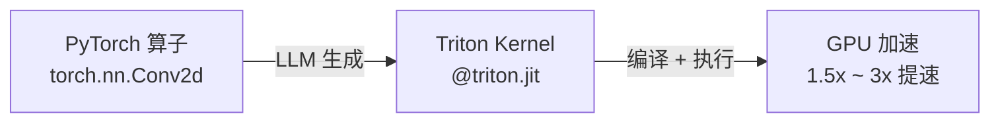
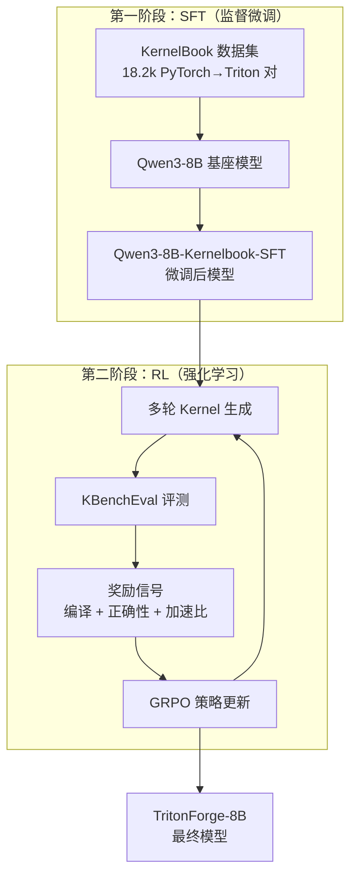
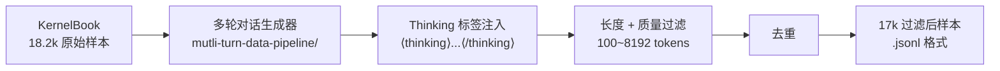

# TritonForge 上手指南

> **目标读者**：希望理解、复现或贡献 TritonForge 的研究者与工程师
> **仓库地址**：[RLsys-Foundation/TritonForge](https://github.com/RLsys-Foundation/TritonForge)

---

## 目录

| 章节 | 难度 | 内容简述 |
|------|------|---------|
| [第一章：项目概览](#第一章项目概览) | ⭐ | TritonForge 是什么、解决什么问题 |
| [第二章：核心概念](#第二章核心概念) | ⭐⭐ | Triton Kernel、SFT/RL 两阶段训练、关键术语 |
| [第三章：环境搭建](#第三章环境搭建) | ⭐⭐ | Docker 容器、依赖安装、模型下载 |
| [第四章：快速评测](#第四章快速评测) | ⭐⭐⭐ | 用 KBenchEval 跑单题评测 |
| [第五章：SFT 训练](#第五章sft-训练) | ⭐⭐⭐⭐ | 数据管线、SFT 脚本详解 |
| [第六章：RL 训练](#第六章rl-训练) | ⭐⭐⭐⭐⭐ | 多轮强化学习训练全流程 |
| [第七章：高级主题与贡献](#第七章高级主题与贡献) | ⭐⭐⭐⭐⭐ | 自定义奖励函数、跨平台适配、插件开发 |

---

## 第一章：项目概览

### 1.1 TritonForge 是什么

TritonForge 是一个用 **SFT + RL（监督微调 + 强化学习）** 训练大语言模型（LLM），使其能够将 **PyTorch 算子** 自动转换为高性能 **Triton GPU Kernel** 的端到端框架。



### 1.2 核心价值

| 能力 | 说明 |
|------|------|
| **两阶段训练** | SFT 建立基线 → RL 迭代优化 |
| **多轮精炼** | 最多 3 轮对话，根据编译报错 / 性能反馈自我纠正 |
| **跨平台** | 同时支持 NVIDIA (CUDA) 和 AMD (ROCm) |
| **完全开源** | 训练数据、模型权重、框架代码、Docker 镜像全部公开 |

### 1.3 仓库结构一览

```
TritonForge/
├── SLIME/                 # RL 训练框架（基于 SLIME 的修复改进版）
│   ├── slime/             # 核心框架代码
│   ├── slime_plugins/     # 自定义插件（生成器 + 奖励函数）
│   ├── scripts/           # 训练启动脚本（SFT / RL × NVIDIA / AMD）
│   └── tools/             # 模型格式转换工具
├── KBenchEval/            # GPU Kernel 评测框架
│   ├── KernelBench/       # 200+ 基准题目（Level 1~4）
│   ├── src/               # 评测逻辑核心代码
│   ├── scripts/           # 评测脚本
│   ├── SFT_data_pipeline/ # SFT 数据生成管线
│   └── results/           # 各 GPU 型号的 Baseline 时间
├── docs/                  # 文档与架构图
│   └── ARCHITECTURE.md    # 系统架构详解
├── README.md
└── ROADMAP.md
```

### 1.4 两个子模块的关系

> **SLIME** 负责「训练」—— 让模型学会写 Kernel。
> **KBenchEval** 负责「评测」—— 检验 Kernel 是否正确且高效。

在 RL 训练中，两者高度耦合：SLIME 生成 Kernel → KBenchEval 编译 + 评测 → 反馈奖励 → SLIME 更新策略。

---

## 第二章：核心概念

### 2.1 Triton Kernel

[Triton](https://github.com/openai/triton) 是 OpenAI 开源的 GPU 编程语言，用 Python 风格编写 Kernel，由 Triton 编译器 JIT 编译为 GPU 机器码。

```python
# 示例：一个简单的向量加法 Triton Kernel
import triton
import triton.language as tl

@triton.jit
def add_kernel(x_ptr, y_ptr, output_ptr, n_elements, BLOCK_SIZE: tl.constexpr):
    pid = tl.program_id(0)
    offsets = pid * BLOCK_SIZE + tl.arange(0, BLOCK_SIZE)
    mask = offsets < n_elements
    x = tl.load(x_ptr + offsets, mask=mask)
    y = tl.load(y_ptr + offsets, mask=mask)
    tl.store(output_ptr + offsets, x + y, mask=mask)
```

TritonForge 的任务就是让 LLM 学会把 `torch.nn.XXX` 自动翻译成类似上面的高性能 Kernel。

### 2.2 两阶段训练流程



### 2.3 关键术语速查

| 术语 | 含义 |
|------|------|
| **SLIME** | Scalable Language model Improvement by Merit-based Exploration — 基础 RL 框架 |
| **GRPO** | Group Relative Policy Optimization — 策略优化算法 |
| **Megatron-LM** | NVIDIA 分布式训练框架，负责模型参数更新 |
| **SGLang** | 高性能推理服务，负责 Rollout（生成 Kernel 文本） |
| **Ray** | 分布式协调框架，管理所有进程的生命周期 |
| **KernelBench** | 200+ GPU Kernel 基准问题集 |
| **KernelBook** | 18.2k 条 PyTorch→Triton 代码对训练数据 |
| **Multi-Turn** | 多轮对话迭代，最多 3 轮，每轮根据反馈改进 |
| **Rollout** | 模型推理生成 Kernel 文本的过程 |
| **fast_p** | 评测指标：既正确、又比 PyTorch 快 p 倍的题目占比 |
| **TP / CP / PP / DP** | 张量并行 / 上下文并行 / 流水线并行 / 数据并行 |

### 2.4 奖励系统详解

RL 训练的核心在于奖励信号的设计：

```
总奖励 = 编译奖励 + 正确性奖励 + 加速奖励
```

| 分量 | 条件 | 奖励值 |
|------|------|--------|
| 编译成功 | 代码能通过 Triton 编译器 | +0.1 |
| 功能正确 | 输出与 PyTorch 参考一致 | +0.3（含编译的 0.1） |
| 性能加速 | speedup > 1.0x | +min(speedup - 1.0, 2.0) |

**多轮折扣**（γ = 0.4）：

```python
total_return = Σ reward_t × (0.4 ^ t)    # t = 0, 1, 2
```

> 第 0 轮的奖励权重最高（1.0），第 1 轮 ×0.4，第 2 轮 ×0.16。这鼓励模型在第一轮就尽量生成高质量 Kernel。

### 2.5 多轮迭代流程

```
Turn 0: [PyTorch 代码] → LLM 生成初始 Kernel → 评测
        ↓ 如果编译失败或性能不佳
Turn 1: [初始 Kernel + 错误信息] → LLM 修复 → 重新评测
        ↓ 如果仍有问题
Turn 2: [改进 Kernel + 性能数据] → LLM 优化 → 最终评测
```

---

## 第三章：环境搭建

### 3.1 硬件需求

| 项目 | NVIDIA 平台 | AMD 平台 |
|------|------------|----------|
| **验证过的 GPU** | H100 (80GB) | MI300X (192GB) |
| **最低显存** | 80GB | 192GB |
| **Docker** | ✅ 必需 | ✅ 必需 |
| **Python** | 3.10+ | 3.10+ |
| **驱动** | CUDA 12.6+ | ROCm 6.3+ |

> [!IMPORTANT]
> 评测（KBenchEval）对显存要求更低（16GB 即可），但完整的 SFT/RL 训练需要 8×H100 级别的集群。

### 3.2 NVIDIA 环境搭建

#### 步骤一：启动 Docker 容器

```bash
docker pull zhuzilin/slime:20250706-v2

docker run --rm --gpus all --ipc=host --shm-size=128g \
  --ulimit memlock=-1 --ulimit stack=67108864 \
  -v $HOME:$HOME \
  -it zhuzilin/slime:20250706-v2 /bin/bash
```

> Docker 镜像已包含 CUDA 12.6、PyTorch、Megatron-LM、SGLang 等全部训练依赖。

#### 步骤二：克隆仓库

```bash
git clone https://github.com/RLsys-Foundation/TritonForge.git
cd TritonForge
```

#### 步骤三：安装 KBenchEval

```bash
cd KBenchEval
python -m venv .venv          # 创建虚拟环境（推荐）
source .venv/bin/activate
pip install --upgrade pip
pip install -r requirements.txt
pip install -e .
deactivate
```

> [!NOTE]
> NVIDIA 环境中 KBenchEval 推荐使用虚拟环境，避免与 Docker 容器中的全局包冲突。

#### 步骤四：安装 SLIME

```bash
cd ../SLIME
pip install -e .
```

#### 步骤五：下载模型

```bash
mkdir -p models

# HuggingFace 格式（用于评测推理）
huggingface-cli download JinnP/Qwen3-8B-Kernelbook-SFT-HF \
  --local-dir models/Qwen3-8B-Kernelbook-SFT-HF

# Megatron 格式（用于继续训练）
huggingface-cli download JinnP/Qwen3-8B-Kernelbook-SFT-filtered \
  --local-dir models/Qwen3-8B-Kernelbook-SFT-filtered

# 基座模型 HuggingFace 格式
huggingface-cli download Qwen/Qwen3-8B \
  --local-dir models/Qwen3-8B

# 基座模型 Megatron 格式
huggingface-cli download zyzshishui0627/Qwen3-8B_torch_dist \
  --local-dir models/Qwen3-8B_torch_dist
```

> [!TIP]
> **模型格式说明**：
> - **HuggingFace 格式**：用于 SGLang 推理服务和 KBenchEval 评测
> - **Megatron (torch_dist) 格式**：用于 Megatron-LM 分布式训练
>
> 可用 `SLIME/tools/convert_hf_to_torch_dist.py` 或 `convert_torch_dist_to_hf.py` 互转。

### 3.3 AMD 环境搭建

#### 步骤一：启动 Docker 容器

```bash
docker pull rlsys/tritonforge:stable

docker run -it \
  --device /dev/dri --device /dev/kfd \
  --group-add video --cap-add SYS_PTRACE \
  --security-opt seccomp=unconfined --privileged \
  --shm-size 128G \
  --ulimit memlock=-1 --ulimit stack=67108864 \
  -v "$HOME/.ssh:/root/.ssh:ro" \
  -v "$HOME:$HOME" \
  -e HF_HOME="$HOME/.cache/huggingface" \
  -w "$PWD" \
  --name tritonforge_dev \
  rlsys/tritonforge:stable /bin/bash
```

#### 步骤二：配置 AMD 环境变量

这些变量必须设置，否则 ROCm 编译和执行会出错：

```bash
# 核心 ROCm 配置（gfx942 特指 MI300X 架构）
export ROCM_HOME=/opt/rocm
export HIP_PLATFORM=amd
export PYTORCH_ROCM_ARCH=gfx942
export PATH=$ROCM_HOME/bin:$PATH
export LD_LIBRARY_PATH=$ROCM_HOME/lib:$LD_LIBRARY_PATH

# 性能优化
export HSA_ENABLE_SDMA=0

# 防止 GPU core dump 导致容器崩溃
export HSA_ENABLE_COREDUMP=0
export AMD_LOG_LEVEL=0
export ROCM_DISABLE_CRASH_DUMP=1
export HIP_ENABLE_COREDUMP=0
export GPU_MAX_HW_QUEUES=1
```

#### 步骤三：安装额外依赖

```bash
pip install pydra_config==0.0.15
cd /usr/local/lib/python3.12/dist-packages && ln -sf pydra_config pydra
pip install together google-generativeai

cd /root/TritonForge/KBenchEval
pip install -e .

cd ../SLIME
pip install -e .
```

> [!WARNING]
> **已知问题**：AMD MI300X 上多轮 RL 训练在 2 步内会因 CPU 100% 利用率导致节点崩溃。
> 当前解决方案：在 AMD 上使用单轮（Single-Turn）训练。详见 [Issue #1](https://github.com/RLsys-Foundation/TritonForge/issues/1)。

---

## 第四章：快速评测

本章不需要训练，只需要一个已有的模型权重和 KBenchEval 环境。

### 4.1 理解 KernelBench 题目

KernelBench 包含 4 个难度级别：

| 级别 | 题目数 | 内容 | 示例 |
|------|--------|------|------|
| **Level 1** 🧱 | 100 | 单算子 | Conv2d、MatMul、LayerNorm |
| **Level 2** 🔗 | 100 | 简单算子融合 | Conv + Bias + ReLU |
| **Level 3** ⚛️ | 50 | 完整模型 | MobileNet、MiniGPT |
| **Level 4** 🤗 | - | HuggingFace 模型 | 完整 Transformer 架构 |

每道题由一个 PyTorch `nn.Module` 定义，评测系统会：
1. 让模型生成对应的 Triton Kernel
2. 编译 Kernel
3. 对比 Triton 输出与 PyTorch 参考输出（正确性）
4. 计时对比性能（加速比）

### 4.2 评测指标

- **fast_0**：正确率（编译成功 + 功能正确的题目占比）
- **fast_1**：正确且 ≥1x 速度的题目占比
- **fast_2**：正确且 ≥2x 速度的题目占比

### 4.3 跑一道单题评测

#### NVIDIA

```bash
cd KBenchEval
source .venv/bin/activate

python scripts/generate_and_eval_single_sample.py \
  dataset_src="huggingface" \
  level=1 \
  problem_id=19 \
  verbose_logging=true
```

#### AMD

```bash
cd KBenchEval

export OPENAI_API_KEY="dummy-key"
python scripts/generate_and_eval_single_sample.py \
  dataset_src=local \
  level=1 \
  problem_id=19 \
  gpu_arch='["MI300X"]' \
  backend=triton \
  server_type=sglang \
  eval_device=0 \
  verbose=True
```

> [!TIP]
> `dataset_src="huggingface"` 会从 HuggingFace 下载题目；`dataset_src=local` 使用本地 `KernelBench/` 目录。
> NVIDIA 环境默认用 CUDA Backend，AMD 环境需显式指定 `backend=triton` 和 `gpu_arch='["MI300X"]'`。

### 4.4 跑批量评测

```bash
# 1. 生成 Kernel（使用 DeepSeek API 或本地 SGLang 服务）
python scripts/generate_samples.py \
  run_name=my_test_level1 \
  dataset_src=huggingface \
  level=1 \
  num_workers=50 \
  server_type=deepseek \
  model_name=deepseek-chat \
  temperature=0

# 2. 评测
python scripts/eval_from_generations.py \
  run_name=my_test_level1 \
  dataset_src=local \
  level=1 \
  num_gpu_devices=8 \
  timeout=300

# 3. 分析结果
python scripts/benchmark_eval_analysis.py \
  run_name=my_test_level1 \
  level=1 \
  hardware=H100 \
  baseline=baseline_time_torch
```

### 4.5 评测服务器模式

对于资源密集的 Triton Kernel，使用评测服务器隔离执行：

```bash
# 标准评测服务器
python scripts/simple_eval_server.py

# 带 CUDA 内存修复的服务器（处理共享内存问题）
python scripts/simple_eval_server_cuda_fix.py
```

### 4.6 生成 Baseline 时间

```bash
# NVIDIA
python scripts/generate_baseline_time.py \
  level=1 hardware_name="H100" num_runs=100

# AMD
bash scripts/run_amd_baseline_generation.sh
```

> 已提供的 Baseline 硬件：MI300X、H100、A100、L40S、B200。建议在你自己的硬件上重新生成以获得准确对比。

---

## 第五章：SFT 训练

### 5.1 数据准备

#### 数据来源

| 数据集 | 规模 | 用途 |
|--------|------|------|
| [GPUMODE/KernelBook](https://huggingface.co/datasets/GPUMODE/KernelBook) | 18.2k 条 | 主要 SFT 数据 |
| [facebook/KernelLLM](https://huggingface.co/datasets/facebook/KernelLLM) | - | 补充数据 |

#### SFT 数据生成管线

数据处理位于 `KBenchEval/SFT_data_pipeline/`：



- **多轮对话生成**：将单条 (PyTorch, Triton) 对转为多轮问答格式
- **Thinking 标签**：在回答前注入 `<thinking>...</thinking>` 推理过程
- **过滤**：移除太短（<100 token）或太长（>8192 token）的样本
- **输出格式**：每行一个 JSON，`messages` 字段包含 chat 格式

### 5.2 SFT 训练脚本详解

主脚本：[run-qwen3-8B-kernelbook-sft.sh](file:///home/robomaster/Research/TritonForge/SLIME/scripts/run-qwen3-8B-kernelbook-sft.sh)

#### 并行策略

```
TP=2（张量并行）× CP=4（上下文并行）× PP=1（流水线并行）= 8 GPUs
DP=1（数据并行 = 总 GPU / (TP × CP × PP)）
```

| 并行维度 | 值 | 说明 |
|---------|---|------|
| **TP=2** | 张量并行 | 将权重矩阵切分到 2 块 GPU，减少单卡显存 |
| **CP=4** | 上下文并行 | 将长序列切分到 4 块 GPU，处理 8192 token 长文本 |
| **PP=1** | 流水线并行 | 不使用流水线切分 |
| **DP=1** | 数据并行 | 单副本训练 |

#### 训练超参

```
Batch Size: 32
Learning Rate: 1e-5 (cosine decay → 1e-6)
Precision: BF16
Optimizer: Adam (β1=0.9, β2=0.95)
Weight Decay: 0.1
Gradient Clip: 1.0
Warmup: 3%
Gradient Recomputation: Full (12 层) ← 减少显存峰值
```

#### 运行流程

```bash
cd SLIME

# 脚本内部会执行以下操作：
# 1. 清理之前的进程（pkill sglang/ray/python）
# 2. 加载模型配置（scripts/models/qwen3-8B.sh）
# 3. 启动 Ray 集群（ray start --head --num-gpus 8）
# 4. 提交 Ray Job 执行 train_async.py

bash scripts/run-qwen3-8B-kernelbook-sft.sh
```

#### 检查点与恢复

- 检查点每 200 步保存一次（`--save-interval 200`）
- 恢复训练时只需保留 `--load` 参数指向检查点目录
- 不要加 `--finetune` 标志（会重置迭代计数器到 0）

### 5.3 模型格式转换

训练使用 Megatron 格式，推理使用 HuggingFace 格式，需要互转：

```bash
# HuggingFace → Megatron
python SLIME/tools/convert_hf_to_torch_dist.py \
  --hf-path models/Qwen3-8B \
  --output-path models/Qwen3-8B_torch_dist

# Megatron → HuggingFace
python SLIME/tools/convert_torch_dist_to_hf.py \
  --torch-dist-path models/Qwen3-8B-Kernelbook-SFT-filtered \
  --output-path models/Qwen3-8B-Kernelbook-SFT-HF
```

---

## 第六章：RL 训练

### 6.1 架构概览

RL 训练涉及 **三个并行服务**，通过 tmux 在不同窗口中启动：

```
┌──────────────────────────────────────────────────────────┐
│                   tmux 会话                               │
├────────────────────┬───────────────────┬─────────────────┤
│ 窗口 1: SLIME      │ 窗口 2: Buffer    │ 窗口 3: Eval    │
│ (训练主进程)        │ (Rollout Buffer)  │ (评测服务器)     │
│                    │                   │                 │
│ Megatron-LM        │ Trajectory        │ KBenchEval      │
│ + SGLang           │ 管理与收集        │ 编译 + 评测      │
│ + Ray 编排         │ (HTTP Server)     │ (HTTP Server)   │
├────────────────────┴───────────────────┴─────────────────┤
│               通信方式：HTTP REST + Ray Remote            │
└──────────────────────────────────────────────────────────┘
```

### 6.2 系统组件详解

#### Megatron-LM（Actor 组）
- 负责模型权重的存储和 GRPO 参数更新
- 使用分布式训练，TP=2, CP=2~4

#### SGLang（Rollout 组）
- 负责高速推理，生成 Kernel 文本
- 训练权重通过 Weight Synchronizer 定期同步到推理服务

---

#### Rollout Buffer 深度解析

**代码位置**：`SLIME/slime_plugins/rollout_buffer/buffer.py`
**启动端口**：`8889`（FastAPI + uvicorn）

##### 设计动机

RL 训练中生成 Kernel 和更新参数是速度严重不匹配的两件事：
每个 Kernel 需要 LLM 推理 + GPU 编译 + 执行评测（慢），而梯度更新需要批量数据（快消耗）。
Buffer 的作用是在二者之间充当**异步解耦层**，让生成侧和训练侧能以各自最优速度运行。

##### 内部架构

```
Generator (SGLang) ──write──▶ BufferQueue ──read──▶ GRPO 训练
                              │
                              ├─ temp_data   (原始轨迹备份，用于元信息统计)
                              ├─ data        (活跃分组，按 instance_id 聚合)
                              └─ group_timestamps (超时检测)
```

Buffer 以 **"分组（Group）"** 为最小消费单位，而非单条轨迹：
- 同一道 KernelBench 题目的多次 Rollout（`n_samples_per_prompt` 个）构成一个 Group
- GRPO 算法需要 Group 内的对比才能计算相对奖励（Group-Relative Returns）
- `group_size = n_samples_per_prompt`（默认 8）

##### Group 的生命周期

```
append() ──▶ temp_data & data 按 instance_id 分组聚合
                │
          is_valid_group() 判断
                │
       ┌────────┴─────────┐
   is_finished?        is_timed_out?
   (收够 group_size)   (超过 300s 未更新)
       │                  │ actual_ratio ≥ 70%?
       ▼                  ▼
   normalize()        normalize()   ← 都继续处理
       │
   pad()       ← 不足 group_size 时填充到标准大小
       │
   get_batch() 返回给训练侧
```

| 参数 | 默认值 | 作用 |
|------|--------|------|
| `group_timeout_seconds` | 300s | 超时的 Group 若凑够 70% 也可释放 |
| `min_valid_group_size_ratio` | 1.0 | Group 必须收满才算 valid |
| `min_valid_item_size_ratio` | 0.7 | 过滤后有效 item ≥ 70% 才 normalize |

##### 奖励归一化流程

Buffer 在交给训练侧之前会对奖励做 Group 内归一化（`normalize_group_data`），以减少跨题目的奖励方差：

```
# 注释摘自源码第 1 行
# raw reward → normalized reward（仅对 valid reward 执行）
# 乘以 group_size / valid_size，与 GRPO 奖励对齐
```

##### HTTP API 一览

| Endpoint | 方法 | 调用方 | 说明 |
|----------|------|--------|------|
| `/start_rollout` | POST | SLIME 主进程 | 触发异步 Rollout（后台任务），携带 task_type 等参数 |
| `/buffer/write` | POST | Generator | 写入单条轨迹数据 |
| `/get_rollout_data` | POST | SLIME 主进程 | 读取一批训练数据（含 normalize + pad），同时持久化到 `rollout_data/` |
| `/buffer/read` | POST | 调试用 | 直接读 buffer（不落盘） |
| `/buffer/stats` | GET | 监控 | 查看 buffer 大小、读写计数 |

调用 `/get_rollout_data` 返回的每条数据包含：

```json
{
  "instance_id": "level1_problem19",
  "prompt": "...",
  "response": "@triton.jit\ndef kernel(...)",
  "reward": 1.1,
  "execution_details": {
    "compiled": true,
    "correctness": true,
    "speedup": 1.8
  }
}
```

Buffer 还会打印批次统计到日志：编译率、正确率、加速比分布（正/负 speedup 分别统计）。

##### 生成器插件发现机制

Buffer 启动时通过 `discover_generators()` **自动扫描** `generator/` 目录下所有 `*_generator.py` 文件，读取每个文件中定义的 `TASK_TYPE` 常量来注册对应的生成器。添加新任务类型只需新建文件，无需修改 buffer 主体。

---

#### Eval Server 深度解析

**代码位置**：`KBenchEval/scripts/eval_server_subprocess.py`
**启动端口**：`18188`（FastAPI + uvicorn）

##### 设计动机：为什么需要进程隔离？

直接在主进程中执行 LLM 生成的 Kernel 有三个危险：
1. **GPU Context 污染**：一个 Kernel 越界写内存后，同一 CUDA Context 内的后续 Kernel 结果不可信
2. **GPU core dump**：AMD 平台尤其严重，崩溃会导致整个容器失去响应
3. **Triton 缓存竞争**：多个进程共享缓存目录导致 JIT 编译结果相互干扰

解决方案：**每次评测都 spawn 一个独立子进程**（`mp.Pool(processes=1)`），子进程死亡不影响父进程。

```
主服务进程 (18188)
    │
    │  POST /eval
    ▼
acquire GPU device (asyncio.Lock 保护)
    │
    ├── spawn 子进程
    │       ├── 设置 CUDA_VISIBLE_DEVICES=device_id
    │       ├── 设置 TRITON_CACHE_DIR=/tmp/triton_cache_gpu_{id}  ← 隔离缓存
    │       ├── import eval_kernel_against_ref()
    │       └── 返回 KernelExecResult（pickle 序列化）
    │
release GPU device
    │
    └── 返回 JSON 给调用方
```

##### GPU 设备池管理

服务启动时检测所有可用 GPU，维护一个 `available_devices` 列表：

```python
# 并发安全：asyncio.Lock + asyncio.Semaphore 双重保护
gpu_semaphore = asyncio.Semaphore(NUM_GPUS)  # 限制并发评测数
device_lock   = asyncio.Lock()               # 保护 available_devices 列表
```

每个请求独占一块 GPU，评测完毕后归还。若所有 GPU 都忙，请求阻塞等待信号量。

##### 错误分类与处理

子进程如果出错，会返回结构化的错误信息（而非直接抛异常），主进程根据 `category` 字段决定返回码：

| category | 原因 | HTTP 状态码 |
|----------|------|-------------|
| `shared_memory_exceeded` | Triton Kernel 申请共享内存超硬件上限 | 500 |
| `illegal_memory_access` | Kernel 越界访问，GPU 报 SIGILL | 500 |
| `unsupported_architecture` | 编译目标架构不匹配 | 500 |
| `syntax_error` | Kernel 代码有 Python 语法错误 | 500 |
| timeout (600s) | Kernel 编译 / 执行无响应 | 504 |

> [!TIP]
> 600 秒的超时是有意为之：子进程需要 spawn 开销 + CUDA context 初始化 + Triton JIT 编译（**无跨进程缓存**），复杂 Kernel 可能需要几分钟。

##### 平台自适应初始化

服务器启动时检测是否为 AMD 环境，并自动调整所有后续子进程的环境变量：

```python
if 'HIP_VISIBLE_DEVICES' in os.environ or os.path.exists('/opt/rocm'):
    IS_AMD_GPU = True
    # 子进程中设置 HIP_PLATFORM=amd，PYTORCH_ROCM_ARCH=gfx942
    # 禁用所有 core dump（HSA_ENABLE_COREDUMP=0 等）
    # HIP_LAUNCH_BLOCKING=1（AMD 同步调试）
else:
    IS_AMD_GPU = False
    # 子进程中 TORCH_USE_CUDA_DSA=1，CUDA_LAUNCH_BLOCKING=1
```

##### HTTP API 一览

| Endpoint | 方法 | 说明 |
|----------|------|------|
| `/eval` | POST | 核心评测接口，接受 Kernel 代码，返回 `KernelExecResult` |
| `/health` | GET | 每块 GPU 的健康状态（在子进程内检测，避免污染） |
| `/gpu_status` | GET | 显存占用、可用设备列表 |
| `/backend_info` | GET | 支持的 backend（cuda / triton）及平台信息 |
| `/reset_devices` | POST | 重置设备池（调试用） |

`/eval` 请求体：

```json
{
  "original_model_src": "PyTorch 参考实现代码（字符串）",
  "custom_model_src":   "LLM 生成的 Triton Kernel 代码（字符串）",
  "num_correct_trials": 5,
  "num_perf_trials":    100,
  "backend":            "triton",
  "measure_performance": true,
  "verbose": false
}
```

返回的 `KernelExecResult` 包含：`compiled`、`correctness`、`speedup`、`runtime_ms` 等字段，这些直接用于奖励函数的计算。

### 6.3 启动 Multi-Turn RL 训练

#### NVIDIA

```bash
cd /root/TritonForge

# 这个脚本会自动创建 3 个 tmux 窗口
bash SLIME/scripts/run_agent_kbench_qwen3_8B_sft_nv_multi_turn.sh
```

脚本内部做了什么：

```
1. 创建 tmux 会话 "slime_qwen3_sft_multi_turn_run"
2. 窗口 1 (slime):     运行 agent-example-kbench-qwen3-8B-sft-nv-multi-turn.sh
3. 窗口 2 (buffer):    等待 30 秒，然后启动 python buffer.py
4. 窗口 3 (eval_server): 等待 30 秒，在 GPU 6,7 上启动 eval_server_subprocess.py
```

> [!IMPORTANT]
> **路径配置**：如果仓库不在 `/root/TritonForge`，需要修改脚本中的 `PROJECT_ROOT` 变量：
> ```bash
> # 在 run_agent_kbench_*.sh 中修改：
> PROJECT_ROOT="/your/path/to/TritonForge"
> ```

#### Single-Turn RL（更稳定，适合 AMD）

```bash
# NVIDIA
bash SLIME/scripts/run_agent_kbench_qwen3_8B_sft_nv_single_turn.sh

# AMD
bash SLIME/scripts/run_agent_kbench_qwen3_8B_sft_amd_singleturn.sh
```

### 6.4 核心训练参数

```bash
# 多轮迭代控制
--max-turns 3                # 最大迭代轮数
--gamma 0.4                  # 折扣因子
--rollout-task-type kernelbench_multiturn

# 推理生成配置
--rollout-batch-size 4       # 每批生成 4 个 prompt
--n-samples-per-prompt 8     # 每个 prompt 生成 8 个候选
--rollout-max-response-len 8192
--rollout-temperature 0.8    # 采样温度

# 训练超参
--learning-rate 1e-5
--micro-batch-size 1
--global-batch-size 128
--seq-length 8192
```

### 6.5 训练监控

```bash
# 查看主训练日志
tail -f SLIME/logs/slime_qwen3_sft_multi_turn_train.log

# 查看 Rollout Buffer 日志
tail -f SLIME/logs/buffer_qwen3_sft_multi_turn.log

# 查看评测服务器日志
tail -f SLIME/logs/eval_server_qwen3_sft_multi_turn.log

# Ray Dashboard（有 Web 界面）
# 浏览器访问 http://localhost:8265
```

#### 关键监控指标

| 指标 | 含义 | 健康值 |
|------|------|--------|
| Compilation Rate | 编译成功率 | > 70% |
| Correctness Rate | 功能正确率 | > 30% |
| Average Speedup | 平均加速比 | > 1.0x |
| Turn Efficiency | 各轮成功率提升 | 逐轮上升 |
| Policy Loss | 策略损失 | 稳定下降 |

### 6.6 训练数据流程（端到端）

```
KernelBench 题目 (PyTorch Module)
    ↓ 采样选题
Prompt 构造 → SGLang 生成 Kernel (Turn 0)
    ↓
Eval Server: 编译 → 正确性 → 性能评测
    ↓
如果不完美 → 构造反馈 Prompt → SGLang 生成 (Turn 1)
    ↓ ... 最多 Turn 2
Rollout Buffer 收集完整轨迹
    ↓
GRPO 计算 Group-Relative Returns
    ↓
Megatron-LM 梯度更新
    ↓
Weight Sync → 更新 SGLang 权重
    ↓ 重复
```

---

## 第七章：高级主题与贡献

### 7.1 自定义奖励函数

奖励函数定义在 `SLIME/slime_plugins/rollout_buffer/generator/kernelbench_config.py`：

```python
def custom_reward_func(eval_result: dict) -> float:
    reward = 0.0
    
    if eval_result.get('compiled', False):
        reward += 0.1                               # 编译成功
    
    if eval_result.get('correctness', False):
        reward += 0.3                               # 功能正确（含编译奖励）
    
    speedup = eval_result.get('speedup', 0.0)
    if speedup > 1.0:
        reward += min(speedup - 1.0, 1.0)          # 性能加速（上限 1.0）
    
    return reward   # 理论最大值 = 0.3 + 1.0 = 1.3（单轮）
```

可以修改此函数来实验不同的奖励设计，例如：
- 增加代码简洁性奖励
- 加入内存使用效率奖励
- 对特定算子类别调整权重

### 7.2 自定义 Kernel 生成器

在 `SLIME/slime_plugins/rollout_buffer/generator/` 中可以实现自定义生成器：

| 文件 | 用途 |
|------|------|
| `kernel_generator.py` | 单轮生成逻辑 |
| `multi_turn_kernel_generator.py` | 多轮迭代生成逻辑 |
| `kernelbench_config.py` | 奖励函数 + 配置 |

扩展方式：

```python
from .base_generator import BaseGenerator

class MyKernelGenerator(BaseGenerator):
    def generate_single_turn(self, prompt: str) -> str:
        # 自定义单轮生成逻辑
        pass
    
    def generate_multi_turn(self, history: List[dict]) -> str:
        # 自定义多轮生成逻辑
        pass
```

### 7.3 SLIME 插件系统

`slime_plugins/` 是 TritonForge 对原版 SLIME 的主要扩展点：

```
slime_plugins/
├── rollout_buffer/
│   ├── buffer.py              # 轨迹缓冲区 HTTP 服务
│   ├── generator/             # 各种 Kernel 生成器
│   └── buffer_tools/          # 辅助工具
├── models/                    # 模型特定实现
└── mbridge/                   # Megatron Bridge 桥接层
```

### 7.4 跨平台适配要点

#### NVIDIA → AMD 主要差异

| 方面 | NVIDIA | AMD |
|------|--------|-----|
| 编译器 | CUDA + Triton JIT | ROCm + HIP Translation |
| Profiler | NSight Systems | rocprof |
| 架构标识 | 自动检测 | 需手动设置 `PYTORCH_ROCM_ARCH=gfx942` |
| 内存隔离 | CUDA 沙箱 | Subprocess 隔离（防止内存 fault 扩散） |
| Multi-Turn | ✅ 稳定 | ⚠️ 已知崩溃问题（使用 Single-Turn） |

#### AMD 特有的环境变量

```bash
# 必须设置，否则编译会静默失败
export HSA_ENABLE_SDMA=0        # 禁用 SDMA（解决数据传输问题）
export GPU_MAX_HW_QUEUES=1      # 限制硬件队列数（提升稳定性）
export HSA_ENABLE_COREDUMP=0    # 禁用 core dump（防止容器崩溃）
```

### 7.5 常见问题排查

#### Q1: 评测服务器报 CUDA OOM

```bash
# 使用带内存修复的评测服务器
python scripts/simple_eval_server_cuda_fix.py
```

#### Q2: AMD 上某些题目导致 GPU 崩溃

已知问题题目：
- Level 1, Problem 42: Max_Pooling_2D
- Level 2, Problem 7: Conv3d_ReLU_LeakyReLU_GELU_Sigmoid_BiasAdd

确保设置了防 core dump 的环境变量（见 7.4 节）。

#### Q3: 训练恢复后 loss 异常

检查是否误加了 `--finetune` 标志——它会将迭代计数器重置为 0，导致 warmup 重新开始。

#### Q4: SGLang 推理服务启动失败

```bash
# 检查端口是否被占用
lsof -i :30000
# 检查 GPU 显存
nvidia-smi  # 或 rocm-smi
```

### 7.6 实验结果参考

| 模型 | Level 1 Pass@1 | Level 2 Pass@1 | 备注 |
|------|---------------|---------------|------|
| **Qwen3-8B-Kernelbook-SFT** | 18% | 8% | 接近 KernelBook baseline (20%) |
| **KernelBook Baseline** | 20% | — | 参考性能 |

多轮 RL 训练的关键发现：
- 多轮精炼比单轮提升 **15-20%**
- 跨平台性能表现一致
- 微调后模型平均提升 **25-30%**
- 多轮设置下编译成功率 **>90%**

### 7.7 贡献指南

欢迎以下方向的贡献：

| 贡献方向 | 说明 |
|---------|------|
| 🏗️ GPU 架构支持 | 扩展到更多 NVIDIA/AMD/Intel GPU 型号 |
| 📚 训练数据 | 贡献高质量 PyTorch→Kernel 示例 |
| 🚀 优化策略 | 开发新的 Kernel 优化技术 |
| 🔄 多轮训练 | 改进迭代精炼流程 |
| 📈 分析工具 | 性能分析与调试工具 |
| 🧪 基准题目 | 贡献新的 KernelBench 问题 |

---

## 附录：快速参考卡片

### 一键命令

```bash
# === 评测 ===
# 单题评测（NVIDIA）
cd KBenchEval && source .venv/bin/activate
python scripts/generate_and_eval_single_sample.py dataset_src="huggingface" level=1 problem_id=19

# === SFT 训练 ===
cd SLIME && bash scripts/run-qwen3-8B-kernelbook-sft.sh

# === RL 训练（多轮，NVIDIA）===
cd /root/TritonForge && bash SLIME/scripts/run_agent_kbench_qwen3_8B_sft_nv_multi_turn.sh

# === RL 训练（单轮，AMD）===
bash SLIME/scripts/run_agent_kbench_qwen3_8B_sft_amd_singleturn.sh

# === 模型格式转换 ===
python SLIME/tools/convert_hf_to_torch_dist.py --hf-path <src> --output-path <dst>
python SLIME/tools/convert_torch_dist_to_hf.py --torch-dist-path <src> --output-path <dst>
```

### 重要文件索引

| 文件 | 用途 |
|------|------|
| [README.md](file:///home/robomaster/Research/TritonForge/README.md) | 项目总览 |
| [docs/ARCHITECTURE.md](file:///home/robomaster/Research/TritonForge/docs/ARCHITECTURE.md) | 系统架构 (含 Mermaid 图) |
| [SLIME/README.md](file:///home/robomaster/Research/TritonForge/SLIME/README.md) | RL 框架文档 |
| [KBenchEval/README.md](file:///home/robomaster/Research/TritonForge/KBenchEval/README.md) | 评测框架文档 |
| [SLIME/scripts/](file:///home/robomaster/Research/TritonForge/SLIME/scripts/) | 所有训练脚本 |
| [KBenchEval/SFT_data_pipeline/](file:///home/robomaster/Research/TritonForge/KBenchEval/SFT_data_pipeline/) | SFT 数据管线 |
| [SLIME/slime_plugins/rollout_buffer/generator/](file:///home/robomaster/Research/TritonForge/SLIME/slime_plugins/rollout_buffer/generator/) | 生成器 + 奖励函数 |

### 外部资源

| 资源 | 链接 |
|------|------|
| 训练数据集 | [GPUMODE/KernelBook](https://huggingface.co/datasets/GPUMODE/KernelBook) |
| SFT 模型权重 | [JinnP/Qwen3-8B-Kernelbook-SFT-HF](https://huggingface.co/JinnP/Qwen3-8B-Kernelbook-SFT-HF) |
| Megatron 格式权重 | [JinnP/Qwen3-8B-Kernelbook-SFT-filtered](https://huggingface.co/JinnP/Qwen3-8B-Kernelbook-SFT-filtered) |
| WandB 训练日志 | [Multi-Turn NV](https://wandb.ai/jhinpan-university-of-michigan/slime-multiturn-qwen3-8B-sft-filtered/runs/5o347842) |
| 技术博客（中文） | [Notion](https://tar-gazelle-668.notion.site/TritonForge-278651cb22e5804c8bd8d0b6ce583fbc) |
| 技术博客（英文） | [Notion](https://tar-gazelle-668.notion.site/TritonForge-Tech-Blog-27e651cb22e581129b43c94b141cf763) |
